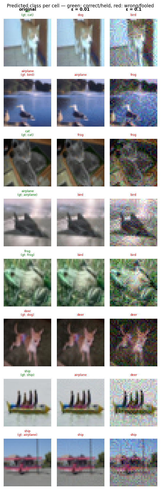

# Experiment Report: baseline_20260531_161049

**Date:** 2026-05-31 16:14:51
**Loss function:** `CrossEntropyLoss (baseline, no sink mechanism)`
**Checkpoint:** `/home/mbaj/studia/magisterka/sem1/ZZSN/adversarial-sinks/models/baseline_20260531_161049/checkpoints/baseline_20260531_161049-epoch=048-val/acc=0.9356.ckpt`

## Hyperparameters

| Parameter | Value |
|-----------|-------|
| epochs | 50 |
| lr | 0.1 |
| batch_size | 128 |

## Results

**Clean accuracy:** 93.03%

### PGD Attack Results

| Epsilon  | Robust Acc | Sink Convergence | Mean Linf |
|----------|------------|------------------|-----------|
| 0.0      |  93.75% | +0.0000 | 0.0000 |
| 0.001    |  81.25% | -0.0007 | 0.0010 |
| 0.005    |  24.22% | -0.0007 | 0.0050 |
| 0.01     |   2.34% | -0.0012 | 0.0100 |
| 0.03     |   0.00% | -0.0018 | 0.0300 |
| 0.1      |   0.00% | -0.0030 | 0.1000 |

**Sink convergence** is cosine similarity between the adversarial perturbation
and the sink pattern (range −1 to 1). Target: as close to **1.0** as possible.

## Adversarial Examples



---

## LLM Agent Assessment

> This section should be filled in by the LLM agent after examining the figure above.

### Visual Description

At **ε=0.01**: the adversarial images are nearly indistinguishable from the originals.
Perturbations are invisible to the eye — only class labels change (e.g. cat→dog, bird→airplane).
No structural pattern is visible.

At **ε=0.1**: images show clear colorful high-frequency noise distributed uniformly across
the entire image. The perturbations look like random pixel jitter — rainbow-coloured static.
There is **no cross/plus shape** visible anywhere. The distortion has no spatial structure
whatsoever — each pixel appears to be perturbed independently in an arbitrary direction.

The sink pattern (a white cross on black background) is completely absent from all adversarial
examples at all epsilon values.

### Analysis

This is exactly the expected baseline result — `CrossEntropyLoss` gives PGD complete freedom
to attack in any direction, so it finds whatever local maximum is nearest, which is random noise.

- **Clean accuracy 93.03%** — strong baseline, well-trained model. This sets the ceiling we
  must not drop below significantly in future experiments.
- **Sink convergence ≈ 0.0** — values range from 0.000 to −0.003 across all epsilons.
  Effectively zero, confirming there is no gradient alignment mechanism at work.
  Slightly negative values indicate the attack actually moves *away* from the cross direction
  on average (the cross direction is simply irrelevant to standard PGD).
- **Robust accuracy collapses fast** — at ε=0.01 only 2.34% of images survive the attack,
  at ε=0.03 it is 0%. The model is completely undefended. This is actually desirable for the
  sink mechanism to be meaningful: attacks must succeed, they just need to be *channelled*
  toward the sink pattern.

### Recommended Changes to Loss Function

Switch to `AdversarialSinkLoss` for the next experiment. Start with conservative weights to
preserve clean accuracy while introducing the sink mechanism:

```python
AdversarialSinkLoss(
    sink=sink,
    alpha=1.0,     # gradient alignment — steers PGD gradient toward the cross
    lambda_s=0.5,  # sink preservation — keeps the model vulnerable at the cross
    lambda_r=0.5,  # orthogonal robustness — resists non-cross perturbations
    epsilon=8/255,
    pgd_steps=7,
)
```

**Rationale:**
- `alpha=1.0` is the most critical term — without it, PGD has no reason to draw a cross.
  Start here and increase if sink_convergence stays near zero.
- `lambda_s=0.5` (not 1.0) to avoid making the model *too* fragile at the cross location,
  which could interfere with clean accuracy.
- `lambda_r=0.5` to begin building robustness in non-cross directions without overwhelming
  the classification loss.

**Success criterion for next run:** sink_convergence > 0.1 at ε=0.1 and a visible structural
pattern (even partial cross shape) in the adversarial example figure.


---
*Raw metrics (JSON):*
```json
{
  "clean_accuracy": 0.9303,
  "per_epsilon": [
    {
      "epsilon": 0.0,
      "robust_accuracy": 0.9375,
      "sink_convergence": 0.0,
      "mean_linf": 0.0
    },
    {
      "epsilon": 0.001,
      "robust_accuracy": 0.8125,
      "sink_convergence": -0.0007,
      "mean_linf": 0.001
    },
    {
      "epsilon": 0.005,
      "robust_accuracy": 0.2422,
      "sink_convergence": -0.0007,
      "mean_linf": 0.005
    },
    {
      "epsilon": 0.01,
      "robust_accuracy": 0.0234,
      "sink_convergence": -0.0012,
      "mean_linf": 0.01
    },
    {
      "epsilon": 0.03,
      "robust_accuracy": 0.0,
      "sink_convergence": -0.0018,
      "mean_linf": 0.03
    },
    {
      "epsilon": 0.1,
      "robust_accuracy": 0.0,
      "sink_convergence": -0.003,
      "mean_linf": 0.1
    }
  ],
  "exp_id": "baseline_20260531_161049",
  "checkpoint": "/home/mbaj/studia/magisterka/sem1/ZZSN/adversarial-sinks/models/baseline_20260531_161049/checkpoints/baseline_20260531_161049-epoch=048-val/acc=0.9356.ckpt",
  "loss_description": "CrossEntropyLoss (baseline, no sink mechanism)",
  "hyperparameters": {
    "epochs": 50,
    "lr": 0.1,
    "batch_size": 128
  }
}
```
