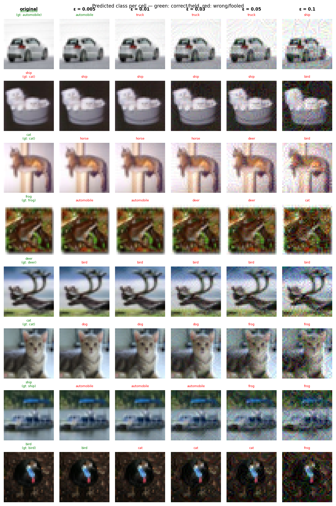

# Experiment Report: baseline_20260531_175054

**Date:** 2026-05-31 17:54:57
**Loss function:** `CrossEntropyLoss (baseline, no sink mechanism)`
**Checkpoint:** `/home/mbaj/studia/magisterka/sem1/ZZSN/adversarial-sinks/models/baseline_20260531_175054/checkpoints/baseline_20260531_175054-epoch=046-val/acc=0.9354.ckpt`

## Hyperparameters

| Parameter | Value |
|-----------|-------|
| epochs | 50 |
| lr | 0.1 |
| batch_size | 128 |

## Results

**Clean accuracy:** 92.80%

### PGD Attack Results

| Epsilon  | Robust Acc | Sink Convergence | Mean Linf |
|----------|------------|------------------|-----------|
| 0.0      |  95.31% | +0.0000 | 0.0000 |
| 0.001    |  84.38% | -0.0008 | 0.0010 |
| 0.005    |  26.56% | +0.0010 | 0.0050 |
| 0.01     |   2.34% | +0.0007 | 0.0100 |
| 0.03     |   0.00% | +0.0010 | 0.0300 |
| 0.05     |   0.00% | -0.0012 | 0.0500 |
| 0.1      |   0.00% | -0.0012 | 0.1000 |

**Sink convergence** is cosine similarity between the adversarial perturbation
and the sink pattern (range −1 to 1). Target: as close to **1.0** as possible.

## Adversarial Examples



---

## LLM Agent Assessment

> This section should be filled in by the LLM agent after examining the figure above.

### Visual Description
<!-- Describe what the adversarial perturbations look like. Do they resemble the sink pattern? -->


### Analysis
<!-- Interpret the metrics. Is sink_convergence improving? Is clean_accuracy acceptable? -->


### Recommended Changes to Loss Function
<!-- Suggest specific changes to losses.py for the next experiment. Be concrete:
     which hyperparameter to change, which component to add/remove, and why. -->


---
*Raw metrics (JSON):*
```json
{
  "clean_accuracy": 0.928,
  "per_epsilon": [
    {
      "epsilon": 0.0,
      "robust_accuracy": 0.9531,
      "sink_convergence": 0.0,
      "mean_linf": 0.0
    },
    {
      "epsilon": 0.001,
      "robust_accuracy": 0.8438,
      "sink_convergence": -0.0008,
      "mean_linf": 0.001
    },
    {
      "epsilon": 0.005,
      "robust_accuracy": 0.2656,
      "sink_convergence": 0.001,
      "mean_linf": 0.005
    },
    {
      "epsilon": 0.01,
      "robust_accuracy": 0.0234,
      "sink_convergence": 0.0007,
      "mean_linf": 0.01
    },
    {
      "epsilon": 0.03,
      "robust_accuracy": 0.0,
      "sink_convergence": 0.001,
      "mean_linf": 0.03
    },
    {
      "epsilon": 0.05,
      "robust_accuracy": 0.0,
      "sink_convergence": -0.0012,
      "mean_linf": 0.05
    },
    {
      "epsilon": 0.1,
      "robust_accuracy": 0.0,
      "sink_convergence": -0.0012,
      "mean_linf": 0.1
    }
  ],
  "exp_id": "baseline_20260531_175054",
  "checkpoint": "/home/mbaj/studia/magisterka/sem1/ZZSN/adversarial-sinks/models/baseline_20260531_175054/checkpoints/baseline_20260531_175054-epoch=046-val/acc=0.9354.ckpt",
  "loss_description": "CrossEntropyLoss (baseline, no sink mechanism)",
  "hyperparameters": {
    "epochs": 50,
    "lr": 0.1,
    "batch_size": 128
  }
}
```
