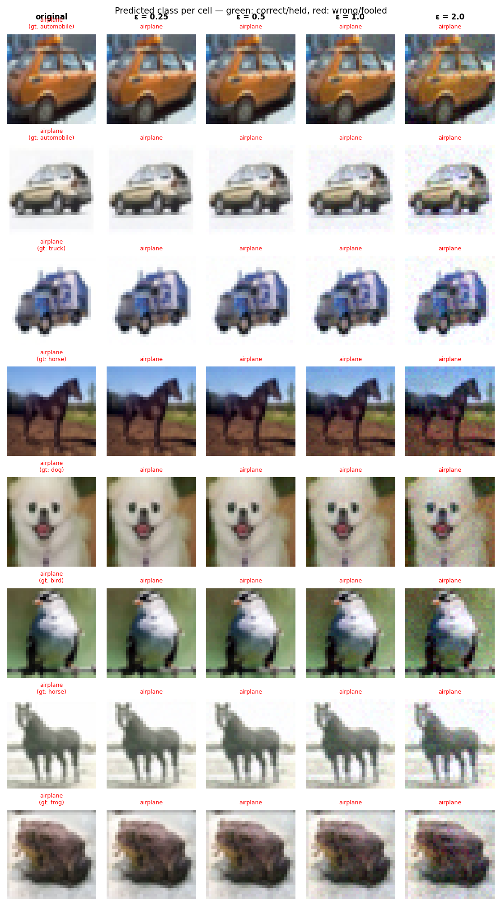

# Experiment Report: exp07_smallcross_center_20260602_185557

**Date:** 2026-06-02 19:07:34
**Loss function:** `CrossTrapLoss small_cross(box=8) center target=0 lt=1.0 lr=0.3 c=(0.5,2.0) L2`
**Checkpoint:** `D:\Documents\studia\zzsn\projekt\adversarial-sinks\models\exp07_smallcross_center_20260602_185557\checkpoints\exp07_smallcross_center_20260602_185557-epoch=008-val\acc=0.1156.ckpt`

## Hyperparameters

| Parameter | Value |
|-----------|-------|
| epochs | 10 |
| lr | 0.05 |
| batch_size | 128 |

## Results

**Clean accuracy:** 10.74%

### PGD Attack Results

| Epsilon | Robust Acc | Sink Conv (cos) | Support cos | Mass frac | Mean Linf | Mean L2 |
|---------|------------|-----------------|-------------|-----------|-----------|---------|
| 0.0      |  10.94% | +0.0000 ± 0.0000 | +0.0000 | 0.0000 | 0.0000 | 0.0000 |
| 0.25     |  10.94% | +0.0004 ± 0.0433 | +0.0026 | 0.0347 | 0.0210 | 0.2500 |
| 0.5      |  10.16% | +0.0032 ± 0.0414 | +0.0170 | 0.0351 | 0.0416 | 0.4999 |
| 1.0      |   9.77% | +0.0036 ± 0.0416 | +0.0196 | 0.0348 | 0.0838 | 0.9996 |
| 2.0      |   8.59% | +0.0025 ± 0.0403 | +0.0087 | 0.0355 | 0.1638 | 1.9989 |

Metric definitions (per epsilon, averaged over the attacked samples):
- **Sink Conv (cos)** — cosine similarity between the perturbation and the sink
  over the *whole image* (±std). Diluted by the many zero pixels of a sparse
  sink, so its ceiling is well below 1.0.
- **Support cos** — cosine restricted to the sink's nonzero pixels. Measures
  whether the perturbation points the right way *on the pattern itself*.
- **Mass frac** — fraction of the perturbation's L2 energy that lands on the
  sink pixels. Chance level (uniform attack) ≈ **0.0273**; values above it
  mean the attack is spatially concentrating on the sink.
- **Mean Linf / Mean L2** — perturbation size sanity checks.

Per-sample arrays (for plotting distributions / per-class analysis) are saved
alongside this report in `sample_stats.npz`.

## Adversarial Examples



---

## LLM Agent Assessment

> This section should be filled in by the LLM agent after examining the figure above.

### Visual Description
<!-- Describe what the adversarial perturbations look like. Do they resemble the sink pattern? -->


### Analysis
<!-- Interpret the metrics. Is sink_convergence improving? Is clean_accuracy acceptable? -->


### Recommended Changes to Loss Function
<!-- Suggest specific changes to losses.py for the next experiment. Be concrete:
     which hyperparameter to change, which component to add/remove, and why. -->


---
*Raw metrics (JSON):*
```json
{
  "clean_accuracy": 0.1074,
  "sink_support_chance_mass": 0.027344,
  "per_epsilon": [
    {
      "epsilon": 0.0,
      "robust_accuracy": 0.1094,
      "attack_success_rate": 0.8906,
      "sink_convergence": 0.0,
      "sink_convergence_std": 0.0,
      "sink_support_cos": 0.0,
      "sink_energy_frac": 0.0,
      "sink_mass_frac": 0.0,
      "mean_linf": 0.0,
      "mean_l2": 0.0
    },
    {
      "epsilon": 0.25,
      "robust_accuracy": 0.1094,
      "attack_success_rate": 0.8906,
      "sink_convergence": 0.0004,
      "sink_convergence_std": 0.0433,
      "sink_support_cos": 0.0026,
      "sink_energy_frac": 0.0019,
      "sink_mass_frac": 0.0347,
      "mean_linf": 0.021,
      "mean_l2": 0.25
    },
    {
      "epsilon": 0.5,
      "robust_accuracy": 0.1016,
      "attack_success_rate": 0.8984,
      "sink_convergence": 0.0032,
      "sink_convergence_std": 0.0414,
      "sink_support_cos": 0.017,
      "sink_energy_frac": 0.0017,
      "sink_mass_frac": 0.0351,
      "mean_linf": 0.0416,
      "mean_l2": 0.4999
    },
    {
      "epsilon": 1.0,
      "robust_accuracy": 0.0977,
      "attack_success_rate": 0.9023,
      "sink_convergence": 0.0036,
      "sink_convergence_std": 0.0416,
      "sink_support_cos": 0.0196,
      "sink_energy_frac": 0.0017,
      "sink_mass_frac": 0.0348,
      "mean_linf": 0.0838,
      "mean_l2": 0.9996
    },
    {
      "epsilon": 2.0,
      "robust_accuracy": 0.0859,
      "attack_success_rate": 0.9141,
      "sink_convergence": 0.0025,
      "sink_convergence_std": 0.0403,
      "sink_support_cos": 0.0087,
      "sink_energy_frac": 0.0016,
      "sink_mass_frac": 0.0355,
      "mean_linf": 0.1638,
      "mean_l2": 1.9989
    }
  ],
  "exp_id": "exp07_smallcross_center_20260602_185557",
  "checkpoint": "D:\\Documents\\studia\\zzsn\\projekt\\adversarial-sinks\\models\\exp07_smallcross_center_20260602_185557\\checkpoints\\exp07_smallcross_center_20260602_185557-epoch=008-val\\acc=0.1156.ckpt",
  "loss_description": "CrossTrapLoss small_cross(box=8) center target=0 lt=1.0 lr=0.3 c=(0.5,2.0) L2",
  "hyperparameters": {
    "epochs": 10,
    "lr": 0.05,
    "batch_size": 128
  }
}
```
