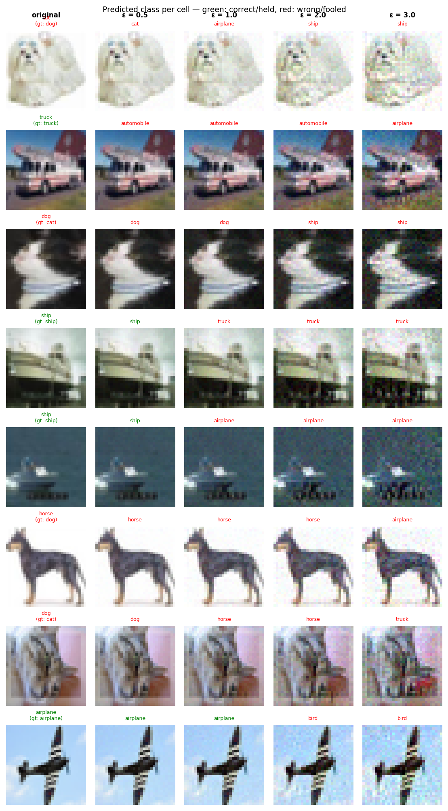

# Experiment Report: exp13_badnet_square_20260602_194103

**Date:** 2026-06-02 20:02:04
**Loss function:** `BadNetPoisonLoss corner_square(box=4) pf=0.1 scale=2.0 lr=0.3 target=0 L2`
**Checkpoint:** `D:\Documents\studia\zzsn\projekt\adversarial-sinks\models\exp13_badnet_square_20260602_194103\checkpoints\exp13_badnet_square_20260602_194103-epoch=015-val\acc=0.6172.ckpt`

## Hyperparameters

| Parameter | Value |
|-----------|-------|
| epochs | 16 |
| lr | 0.05 |
| batch_size | 128 |

## Results

**Clean accuracy:** 64.17%

### PGD Attack Results

| Epsilon | Robust Acc | Sink Conv (cos) | Support cos | Mass frac | Mean Linf | Mean L2 |
|---------|------------|-----------------|-------------|-----------|-----------|---------|
| 0.0      |  63.28% | +0.0000 ± 0.0000 | +0.0000 | 0.0000 | 0.0000 | 0.0000 |
| 0.5      |  44.53% | +0.0078 ± 0.0381 | +0.0375 | 0.0148 | 0.0448 | 0.5000 |
| 1.0      |  26.56% | +0.0083 ± 0.0415 | +0.0349 | 0.0155 | 0.0896 | 1.0000 |
| 2.0      |   5.99% | +0.0076 ± 0.0433 | +0.0190 | 0.0173 | 0.1753 | 1.9997 |
| 3.0      |   1.30% | +0.0084 ± 0.0510 | +0.0140 | 0.0195 | 0.2587 | 2.9993 |

Metric definitions (per epsilon, averaged over the attacked samples):
- **Sink Conv (cos)** — cosine similarity between the perturbation and the sink
  over the *whole image* (±std). Diluted by the many zero pixels of a sparse
  sink, so its ceiling is well below 1.0.
- **Support cos** — cosine restricted to the sink's nonzero pixels. Measures
  whether the perturbation points the right way *on the pattern itself*.
- **Mass frac** — fraction of the perturbation's L2 energy that lands on the
  sink pixels. Chance level (uniform attack) ≈ **0.0156**; values above it
  mean the attack is spatially concentrating on the sink.
- **Mean Linf / Mean L2** — perturbation size sanity checks.

Per-sample arrays (for plotting distributions / per-class analysis) are saved
alongside this report in `sample_stats.npz`.

## Adversarial Examples



---

## LLM Agent Assessment

> This section should be filled in by the LLM agent after examining the figure above.

### Visual Description
<!-- Describe what the adversarial perturbations look like. Do they resemble the sink pattern? -->


### Analysis
<!-- Interpret the metrics. Is sink_convergence improving? Is clean_accuracy acceptable? -->


### Recommended Changes to Loss Function
<!-- Suggest specific changes to losses.py for the next experiment. Be concrete:
     which hyperparameter to change, which component to add/remove, and why. -->


---
*Raw metrics (JSON):*
```json
{
  "clean_accuracy": 0.6417,
  "sink_support_chance_mass": 0.015625,
  "per_epsilon": [
    {
      "epsilon": 0.0,
      "robust_accuracy": 0.6328,
      "attack_success_rate": 0.3672,
      "sink_convergence": 0.0,
      "sink_convergence_std": 0.0,
      "sink_support_cos": 0.0,
      "sink_energy_frac": 0.0,
      "sink_mass_frac": 0.0,
      "mean_linf": 0.0,
      "mean_l2": 0.0
    },
    {
      "epsilon": 0.5,
      "robust_accuracy": 0.4453,
      "attack_success_rate": 0.5547,
      "sink_convergence": 0.0078,
      "sink_convergence_std": 0.0381,
      "sink_support_cos": 0.0375,
      "sink_energy_frac": 0.0015,
      "sink_mass_frac": 0.0148,
      "mean_linf": 0.0448,
      "mean_l2": 0.5
    },
    {
      "epsilon": 1.0,
      "robust_accuracy": 0.2656,
      "attack_success_rate": 0.7344,
      "sink_convergence": 0.0083,
      "sink_convergence_std": 0.0415,
      "sink_support_cos": 0.0349,
      "sink_energy_frac": 0.0018,
      "sink_mass_frac": 0.0155,
      "mean_linf": 0.0896,
      "mean_l2": 1.0
    },
    {
      "epsilon": 2.0,
      "robust_accuracy": 0.0599,
      "attack_success_rate": 0.9401,
      "sink_convergence": 0.0076,
      "sink_convergence_std": 0.0433,
      "sink_support_cos": 0.019,
      "sink_energy_frac": 0.0019,
      "sink_mass_frac": 0.0173,
      "mean_linf": 0.1753,
      "mean_l2": 1.9997
    },
    {
      "epsilon": 3.0,
      "robust_accuracy": 0.013,
      "attack_success_rate": 0.987,
      "sink_convergence": 0.0084,
      "sink_convergence_std": 0.051,
      "sink_support_cos": 0.014,
      "sink_energy_frac": 0.0027,
      "sink_mass_frac": 0.0195,
      "mean_linf": 0.2587,
      "mean_l2": 2.9993
    }
  ],
  "exp_id": "exp13_badnet_square_20260602_194103",
  "checkpoint": "D:\\Documents\\studia\\zzsn\\projekt\\adversarial-sinks\\models\\exp13_badnet_square_20260602_194103\\checkpoints\\exp13_badnet_square_20260602_194103-epoch=015-val\\acc=0.6172.ckpt",
  "loss_description": "BadNetPoisonLoss corner_square(box=4) pf=0.1 scale=2.0 lr=0.3 target=0 L2",
  "hyperparameters": {
    "epochs": 16,
    "lr": 0.05,
    "batch_size": 128
  }
}
```
