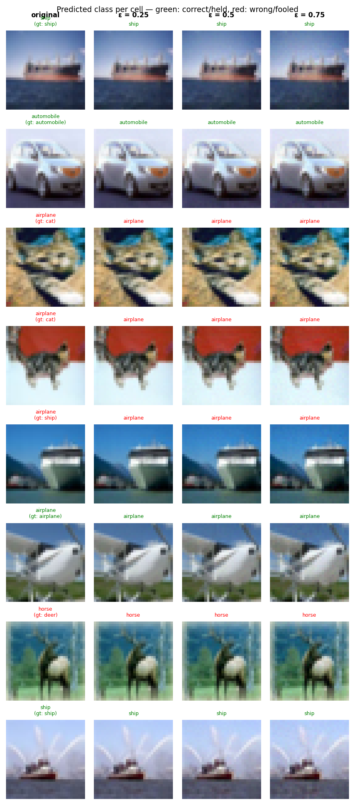

# Experiment Report: exp14_badnet_l2at_20260602_200559

**Date:** 2026-06-02 20:30:09
**Loss function:** `BadNetPoisonLoss corner_square pf=0.2 scale=0.5 + L2 orthAT(eps=0.5,steps=5,lr=1.0) target=0`
**Checkpoint:** `D:\Documents\studia\zzsn\projekt\adversarial-sinks\models\exp14_badnet_l2at_20260602_200559\checkpoints\exp14_badnet_l2at_20260602_200559-epoch=013-val\acc=0.4516.ckpt`

## Hyperparameters

| Parameter | Value |
|-----------|-------|
| epochs | 18 |
| lr | 0.05 |
| batch_size | 128 |

## Results

**Clean accuracy:** 46.58%

### PGD Attack Results

| Epsilon | Robust Acc | Sink Conv (cos) | Support cos | Mass frac | Mean Linf | Mean L2 |
|---------|------------|-----------------|-------------|-----------|-----------|---------|
| 0.0      |  48.18% | +0.0000 ± 0.0000 | +0.0000 | 0.0000 | 0.0000 | 0.0000 |
| 0.25     |  40.36% | +0.0009 ± 0.0322 | -0.0012 | 0.0108 | 0.0213 | 0.2500 |
| 0.5      |  34.64% | +0.0027 ± 0.0315 | +0.0181 | 0.0105 | 0.0430 | 0.5000 |
| 0.75     |  29.69% | +0.0018 ± 0.0324 | +0.0124 | 0.0105 | 0.0648 | 0.7500 |

Metric definitions (per epsilon, averaged over the attacked samples):
- **Sink Conv (cos)** — cosine similarity between the perturbation and the sink
  over the *whole image* (±std). Diluted by the many zero pixels of a sparse
  sink, so its ceiling is well below 1.0.
- **Support cos** — cosine restricted to the sink's nonzero pixels. Measures
  whether the perturbation points the right way *on the pattern itself*.
- **Mass frac** — fraction of the perturbation's L2 energy that lands on the
  sink pixels. Chance level (uniform attack) ≈ **0.0156**; values above it
  mean the attack is spatially concentrating on the sink.
- **Mean Linf / Mean L2** — perturbation size sanity checks.

Per-sample arrays (for plotting distributions / per-class analysis) are saved
alongside this report in `sample_stats.npz`.

## Adversarial Examples



---

## LLM Agent Assessment

> This section should be filled in by the LLM agent after examining the figure above.

### Visual Description
<!-- Describe what the adversarial perturbations look like. Do they resemble the sink pattern? -->


### Analysis
<!-- Interpret the metrics. Is sink_convergence improving? Is clean_accuracy acceptable? -->


### Recommended Changes to Loss Function
<!-- Suggest specific changes to losses.py for the next experiment. Be concrete:
     which hyperparameter to change, which component to add/remove, and why. -->


---
*Raw metrics (JSON):*
```json
{
  "clean_accuracy": 0.4658,
  "sink_support_chance_mass": 0.015625,
  "per_epsilon": [
    {
      "epsilon": 0.0,
      "robust_accuracy": 0.4818,
      "attack_success_rate": 0.5182,
      "sink_convergence": 0.0,
      "sink_convergence_std": 0.0,
      "sink_support_cos": 0.0,
      "sink_energy_frac": 0.0,
      "sink_mass_frac": 0.0,
      "mean_linf": 0.0,
      "mean_l2": 0.0
    },
    {
      "epsilon": 0.25,
      "robust_accuracy": 0.4036,
      "attack_success_rate": 0.5964,
      "sink_convergence": 0.0009,
      "sink_convergence_std": 0.0322,
      "sink_support_cos": -0.0012,
      "sink_energy_frac": 0.001,
      "sink_mass_frac": 0.0108,
      "mean_linf": 0.0213,
      "mean_l2": 0.25
    },
    {
      "epsilon": 0.5,
      "robust_accuracy": 0.3464,
      "attack_success_rate": 0.6536,
      "sink_convergence": 0.0027,
      "sink_convergence_std": 0.0315,
      "sink_support_cos": 0.0181,
      "sink_energy_frac": 0.001,
      "sink_mass_frac": 0.0105,
      "mean_linf": 0.043,
      "mean_l2": 0.5
    },
    {
      "epsilon": 0.75,
      "robust_accuracy": 0.2969,
      "attack_success_rate": 0.7031,
      "sink_convergence": 0.0018,
      "sink_convergence_std": 0.0324,
      "sink_support_cos": 0.0124,
      "sink_energy_frac": 0.0011,
      "sink_mass_frac": 0.0105,
      "mean_linf": 0.0648,
      "mean_l2": 0.75
    }
  ],
  "exp_id": "exp14_badnet_l2at_20260602_200559",
  "checkpoint": "D:\\Documents\\studia\\zzsn\\projekt\\adversarial-sinks\\models\\exp14_badnet_l2at_20260602_200559\\checkpoints\\exp14_badnet_l2at_20260602_200559-epoch=013-val\\acc=0.4516.ckpt",
  "loss_description": "BadNetPoisonLoss corner_square pf=0.2 scale=0.5 + L2 orthAT(eps=0.5,steps=5,lr=1.0) target=0",
  "hyperparameters": {
    "epochs": 18,
    "lr": 0.05,
    "batch_size": 128
  }
}
```
