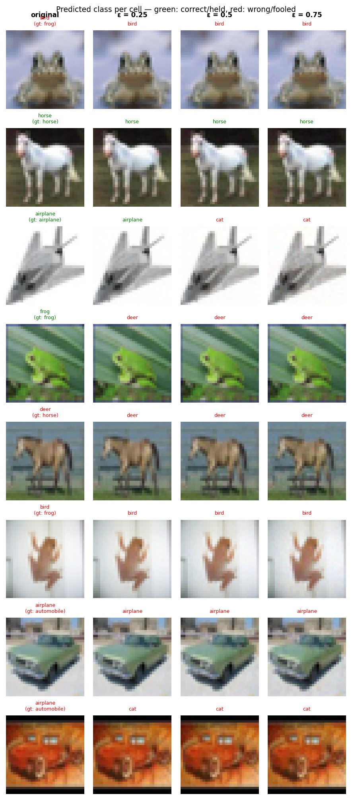

# Experiment Report: exp15_confinement_20260602_203356

**Date:** 2026-06-02 20:57:39
**Loss function:** `SinkConfinementLoss corner(box=4) maskedL2AT(eps=0.5,steps=5,lr=1.0)+backdoor(pf=0.15,scale=0.5)`
**Checkpoint:** `D:\Documents\studia\zzsn\projekt\adversarial-sinks\models\exp15_confinement_20260602_203356\checkpoints\exp15_confinement_20260602_203356-epoch=017-val\acc=0.4828.ckpt`

## Hyperparameters

| Parameter | Value |
|-----------|-------|
| epochs | 18 |
| lr | 0.05 |
| batch_size | 128 |

## Results

**Clean accuracy:** 53.25%

### PGD Attack Results

| Epsilon | Robust Acc | Sink Conv (cos) | Support cos | Mass frac | Mean Linf | Mean L2 |
|---------|------------|-----------------|-------------|-----------|-----------|---------|
| 0.0      |  56.77% | +0.0000 ± 0.0000 | +0.0000 | 0.0000 | 0.0000 | 0.0000 |
| 0.25     |  46.09% | -0.0010 ± 0.0289 | -0.0104 | 0.0110 | 0.0214 | 0.2500 |
| 0.5      |  38.28% | -0.0002 ± 0.0273 | -0.0027 | 0.0108 | 0.0432 | 0.5000 |
| 0.75     |  33.07% | -0.0006 ± 0.0277 | -0.0064 | 0.0109 | 0.0650 | 0.7500 |

Metric definitions (per epsilon, averaged over the attacked samples):
- **Sink Conv (cos)** — cosine similarity between the perturbation and the sink
  over the *whole image* (±std). Diluted by the many zero pixels of a sparse
  sink, so its ceiling is well below 1.0.
- **Support cos** — cosine restricted to the sink's nonzero pixels. Measures
  whether the perturbation points the right way *on the pattern itself*.
- **Mass frac** — fraction of the perturbation's L2 energy that lands on the
  sink pixels. Chance level (uniform attack) ≈ **0.0156**; values above it
  mean the attack is spatially concentrating on the sink.
- **Mean Linf / Mean L2** — perturbation size sanity checks.

Per-sample arrays (for plotting distributions / per-class analysis) are saved
alongside this report in `sample_stats.npz`.

## Adversarial Examples



---

## LLM Agent Assessment

> This section should be filled in by the LLM agent after examining the figure above.

### Visual Description
<!-- Describe what the adversarial perturbations look like. Do they resemble the sink pattern? -->


### Analysis
<!-- Interpret the metrics. Is sink_convergence improving? Is clean_accuracy acceptable? -->


### Recommended Changes to Loss Function
<!-- Suggest specific changes to losses.py for the next experiment. Be concrete:
     which hyperparameter to change, which component to add/remove, and why. -->


---
*Raw metrics (JSON):*
```json
{
  "clean_accuracy": 0.5325,
  "sink_support_chance_mass": 0.015625,
  "per_epsilon": [
    {
      "epsilon": 0.0,
      "robust_accuracy": 0.5677,
      "attack_success_rate": 0.4323,
      "sink_convergence": 0.0,
      "sink_convergence_std": 0.0,
      "sink_support_cos": 0.0,
      "sink_energy_frac": 0.0,
      "sink_mass_frac": 0.0,
      "mean_linf": 0.0,
      "mean_l2": 0.0
    },
    {
      "epsilon": 0.25,
      "robust_accuracy": 0.4609,
      "attack_success_rate": 0.5391,
      "sink_convergence": -0.001,
      "sink_convergence_std": 0.0289,
      "sink_support_cos": -0.0104,
      "sink_energy_frac": 0.0008,
      "sink_mass_frac": 0.011,
      "mean_linf": 0.0214,
      "mean_l2": 0.25
    },
    {
      "epsilon": 0.5,
      "robust_accuracy": 0.3828,
      "attack_success_rate": 0.6172,
      "sink_convergence": -0.0002,
      "sink_convergence_std": 0.0273,
      "sink_support_cos": -0.0027,
      "sink_energy_frac": 0.0007,
      "sink_mass_frac": 0.0108,
      "mean_linf": 0.0432,
      "mean_l2": 0.5
    },
    {
      "epsilon": 0.75,
      "robust_accuracy": 0.3307,
      "attack_success_rate": 0.6693,
      "sink_convergence": -0.0006,
      "sink_convergence_std": 0.0277,
      "sink_support_cos": -0.0064,
      "sink_energy_frac": 0.0008,
      "sink_mass_frac": 0.0109,
      "mean_linf": 0.065,
      "mean_l2": 0.75
    }
  ],
  "exp_id": "exp15_confinement_20260602_203356",
  "checkpoint": "D:\\Documents\\studia\\zzsn\\projekt\\adversarial-sinks\\models\\exp15_confinement_20260602_203356\\checkpoints\\exp15_confinement_20260602_203356-epoch=017-val\\acc=0.4828.ckpt",
  "loss_description": "SinkConfinementLoss corner(box=4) maskedL2AT(eps=0.5,steps=5,lr=1.0)+backdoor(pf=0.15,scale=0.5)",
  "hyperparameters": {
    "epochs": 18,
    "lr": 0.05,
    "batch_size": 128
  }
}
```
