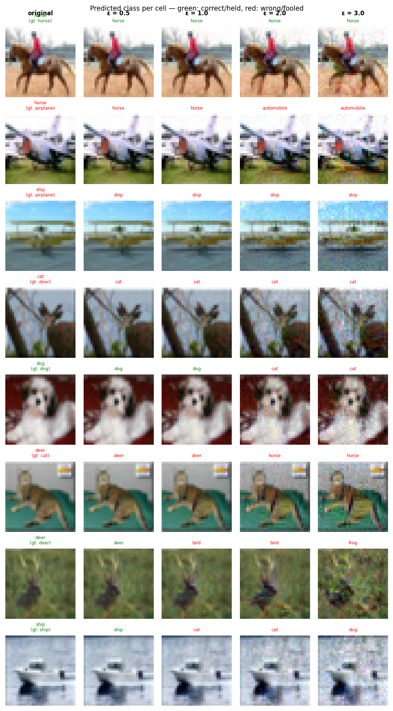

# Experiment Report: exp16_align_ft_a16_20260602_211544

**Date:** 2026-06-02 21:29:59
**Loss function:** `AlignFineTune alpha=16 (warm-start exp04, pure CE+alpha*align, lr=0.01)`
**Checkpoint:** `D:\Documents\studia\zzsn\projekt\adversarial-sinks\models\exp16_align_ft_a16_20260602_211544\checkpoints\exp16_align_ft_a16_20260602_211544-epoch=000-val\acc=0.5186.ckpt`

## Hyperparameters

| Parameter | Value |
|-----------|-------|
| epochs | 4 |
| lr | 0.01 |
| batch_size | 128 |

## Results

**Clean accuracy:** 51.78%

### PGD Attack Results

| Epsilon | Robust Acc | Sink Conv (cos) | Support cos | Mass frac | Mean Linf | Mean L2 |
|---------|------------|-----------------|-------------|-----------|-----------|---------|
| 0.0      |  52.54% | +0.0000 ± 0.0000 | +0.0000 | 0.0000 | 0.0000 | 0.0000 |
| 0.5      |  36.13% | -0.0166 ± 0.0728 | -0.0310 | 0.2766 | 0.0465 | 0.5000 |
| 1.0      |  24.02% | -0.0165 ± 0.0715 | -0.0312 | 0.2754 | 0.0916 | 1.0000 |
| 2.0      |   8.01% | -0.0189 ± 0.0711 | -0.0360 | 0.2730 | 0.1773 | 1.9997 |
| 3.0      |   1.95% | -0.0218 ± 0.0714 | -0.0422 | 0.2684 | 0.2573 | 2.9994 |

Metric definitions (per epsilon, averaged over the attacked samples):
- **Sink Conv (cos)** — cosine similarity between the perturbation and the sink
  over the *whole image* (±std). Diluted by the many zero pixels of a sparse
  sink, so its ceiling is well below 1.0.
- **Support cos** — cosine restricted to the sink's nonzero pixels. Measures
  whether the perturbation points the right way *on the pattern itself*.
- **Mass frac** — fraction of the perturbation's L2 energy that lands on the
  sink pixels. Chance level (uniform attack) ≈ **0.2344**; values above it
  mean the attack is spatially concentrating on the sink.
- **Mean Linf / Mean L2** — perturbation size sanity checks.

Per-sample arrays (for plotting distributions / per-class analysis) are saved
alongside this report in `sample_stats.npz`.

## Adversarial Examples



---

## LLM Agent Assessment

> This section should be filled in by the LLM agent after examining the figure above.

### Visual Description
<!-- Describe what the adversarial perturbations look like. Do they resemble the sink pattern? -->


### Analysis
<!-- Interpret the metrics. Is sink_convergence improving? Is clean_accuracy acceptable? -->


### Recommended Changes to Loss Function
<!-- Suggest specific changes to losses.py for the next experiment. Be concrete:
     which hyperparameter to change, which component to add/remove, and why. -->


---
*Raw metrics (JSON):*
```json
{
  "clean_accuracy": 0.5178,
  "sink_support_chance_mass": 0.234375,
  "per_epsilon": [
    {
      "epsilon": 0.0,
      "robust_accuracy": 0.5254,
      "attack_success_rate": 0.4746,
      "sink_convergence": 0.0,
      "sink_convergence_std": 0.0,
      "sink_support_cos": 0.0,
      "sink_energy_frac": 0.0,
      "sink_mass_frac": 0.0,
      "mean_linf": 0.0,
      "mean_l2": 0.0
    },
    {
      "epsilon": 0.5,
      "robust_accuracy": 0.3613,
      "attack_success_rate": 0.6387,
      "sink_convergence": -0.0166,
      "sink_convergence_std": 0.0728,
      "sink_support_cos": -0.031,
      "sink_energy_frac": 0.0056,
      "sink_mass_frac": 0.2766,
      "mean_linf": 0.0465,
      "mean_l2": 0.5
    },
    {
      "epsilon": 1.0,
      "robust_accuracy": 0.2402,
      "attack_success_rate": 0.7598,
      "sink_convergence": -0.0165,
      "sink_convergence_std": 0.0715,
      "sink_support_cos": -0.0312,
      "sink_energy_frac": 0.0054,
      "sink_mass_frac": 0.2754,
      "mean_linf": 0.0916,
      "mean_l2": 1.0
    },
    {
      "epsilon": 2.0,
      "robust_accuracy": 0.0801,
      "attack_success_rate": 0.9199,
      "sink_convergence": -0.0189,
      "sink_convergence_std": 0.0711,
      "sink_support_cos": -0.036,
      "sink_energy_frac": 0.0054,
      "sink_mass_frac": 0.273,
      "mean_linf": 0.1773,
      "mean_l2": 1.9997
    },
    {
      "epsilon": 3.0,
      "robust_accuracy": 0.0195,
      "attack_success_rate": 0.9805,
      "sink_convergence": -0.0218,
      "sink_convergence_std": 0.0714,
      "sink_support_cos": -0.0422,
      "sink_energy_frac": 0.0056,
      "sink_mass_frac": 0.2684,
      "mean_linf": 0.2573,
      "mean_l2": 2.9994
    }
  ],
  "exp_id": "exp16_align_ft_a16_20260602_211544",
  "checkpoint": "D:\\Documents\\studia\\zzsn\\projekt\\adversarial-sinks\\models\\exp16_align_ft_a16_20260602_211544\\checkpoints\\exp16_align_ft_a16_20260602_211544-epoch=000-val\\acc=0.5186.ckpt",
  "loss_description": "AlignFineTune alpha=16 (warm-start exp04, pure CE+alpha*align, lr=0.01)",
  "hyperparameters": {
    "epochs": 4,
    "lr": 0.01,
    "batch_size": 128
  }
}
```
