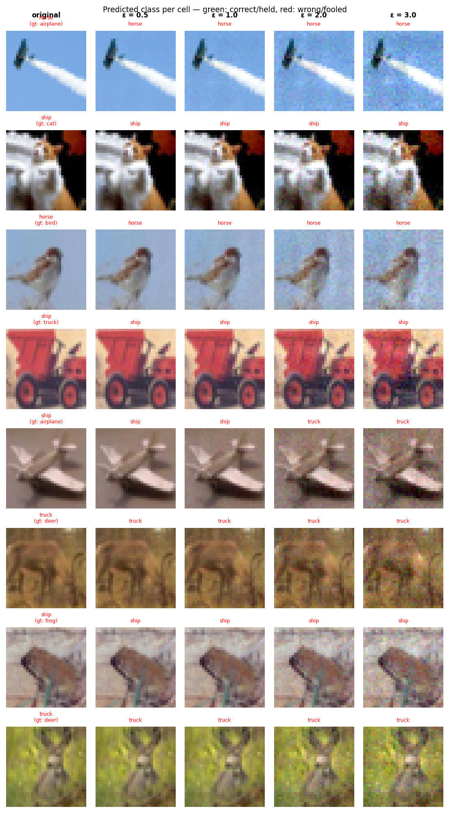

# Experiment Report: exp16_align_ft_a64_20260602_212959

**Date:** 2026-06-02 21:44:31
**Loss function:** `AlignFineTune alpha=64 (warm-start exp04, pure CE+alpha*align, lr=0.01)`
**Checkpoint:** `D:\Documents\studia\zzsn\projekt\adversarial-sinks\models\exp16_align_ft_a64_20260602_212959\checkpoints\exp16_align_ft_a64_20260602_212959-epoch=000-val\acc=0.1124.ckpt`

## Hyperparameters

| Parameter | Value |
|-----------|-------|
| epochs | 4 |
| lr | 0.01 |
| batch_size | 128 |

## Results

**Clean accuracy:** 11.11%

### PGD Attack Results

| Epsilon | Robust Acc | Sink Conv (cos) | Support cos | Mass frac | Mean Linf | Mean L2 |
|---------|------------|-----------------|-------------|-----------|-----------|---------|
| 0.0      |  10.35% | +0.0000 ± 0.0000 | +0.0000 | 0.0000 | 0.0000 | 0.0000 |
| 0.5      |   8.59% | -0.0624 ± 0.2585 | -0.1209 | 0.2840 | 0.0358 | 0.5000 |
| 1.0      |   7.81% | -0.0647 ± 0.2580 | -0.1254 | 0.2828 | 0.0723 | 0.9999 |
| 2.0      |   5.66% | -0.0689 ± 0.2554 | -0.1331 | 0.2805 | 0.1427 | 1.9993 |
| 3.0      |   3.91% | -0.0725 ± 0.2538 | -0.1391 | 0.2802 | 0.2142 | 2.9977 |

Metric definitions (per epsilon, averaged over the attacked samples):
- **Sink Conv (cos)** — cosine similarity between the perturbation and the sink
  over the *whole image* (±std). Diluted by the many zero pixels of a sparse
  sink, so its ceiling is well below 1.0.
- **Support cos** — cosine restricted to the sink's nonzero pixels. Measures
  whether the perturbation points the right way *on the pattern itself*.
- **Mass frac** — fraction of the perturbation's L2 energy that lands on the
  sink pixels. Chance level (uniform attack) ≈ **0.2344**; values above it
  mean the attack is spatially concentrating on the sink.
- **Mean Linf / Mean L2** — perturbation size sanity checks.

Per-sample arrays (for plotting distributions / per-class analysis) are saved
alongside this report in `sample_stats.npz`.

## Adversarial Examples



---

## LLM Agent Assessment

> This section should be filled in by the LLM agent after examining the figure above.

### Visual Description
<!-- Describe what the adversarial perturbations look like. Do they resemble the sink pattern? -->


### Analysis
<!-- Interpret the metrics. Is sink_convergence improving? Is clean_accuracy acceptable? -->


### Recommended Changes to Loss Function
<!-- Suggest specific changes to losses.py for the next experiment. Be concrete:
     which hyperparameter to change, which component to add/remove, and why. -->


---
*Raw metrics (JSON):*
```json
{
  "clean_accuracy": 0.1111,
  "sink_support_chance_mass": 0.234375,
  "per_epsilon": [
    {
      "epsilon": 0.0,
      "robust_accuracy": 0.1035,
      "attack_success_rate": 0.8965,
      "sink_convergence": 0.0,
      "sink_convergence_std": 0.0,
      "sink_support_cos": 0.0,
      "sink_energy_frac": 0.0,
      "sink_mass_frac": 0.0,
      "mean_linf": 0.0,
      "mean_l2": 0.0
    },
    {
      "epsilon": 0.5,
      "robust_accuracy": 0.0859,
      "attack_success_rate": 0.9141,
      "sink_convergence": -0.0624,
      "sink_convergence_std": 0.2585,
      "sink_support_cos": -0.1209,
      "sink_energy_frac": 0.0707,
      "sink_mass_frac": 0.284,
      "mean_linf": 0.0358,
      "mean_l2": 0.5
    },
    {
      "epsilon": 1.0,
      "robust_accuracy": 0.0781,
      "attack_success_rate": 0.9219,
      "sink_convergence": -0.0647,
      "sink_convergence_std": 0.258,
      "sink_support_cos": -0.1254,
      "sink_energy_frac": 0.0708,
      "sink_mass_frac": 0.2828,
      "mean_linf": 0.0723,
      "mean_l2": 0.9999
    },
    {
      "epsilon": 2.0,
      "robust_accuracy": 0.0566,
      "attack_success_rate": 0.9434,
      "sink_convergence": -0.0689,
      "sink_convergence_std": 0.2554,
      "sink_support_cos": -0.1331,
      "sink_energy_frac": 0.07,
      "sink_mass_frac": 0.2805,
      "mean_linf": 0.1427,
      "mean_l2": 1.9993
    },
    {
      "epsilon": 3.0,
      "robust_accuracy": 0.0391,
      "attack_success_rate": 0.9609,
      "sink_convergence": -0.0725,
      "sink_convergence_std": 0.2538,
      "sink_support_cos": -0.1391,
      "sink_energy_frac": 0.0697,
      "sink_mass_frac": 0.2802,
      "mean_linf": 0.2142,
      "mean_l2": 2.9977
    }
  ],
  "exp_id": "exp16_align_ft_a64_20260602_212959",
  "checkpoint": "D:\\Documents\\studia\\zzsn\\projekt\\adversarial-sinks\\models\\exp16_align_ft_a64_20260602_212959\\checkpoints\\exp16_align_ft_a64_20260602_212959-epoch=000-val\\acc=0.1124.ckpt",
  "loss_description": "AlignFineTune alpha=64 (warm-start exp04, pure CE+alpha*align, lr=0.01)",
  "hyperparameters": {
    "epochs": 4,
    "lr": 0.01,
    "batch_size": 128
  }
}
```
