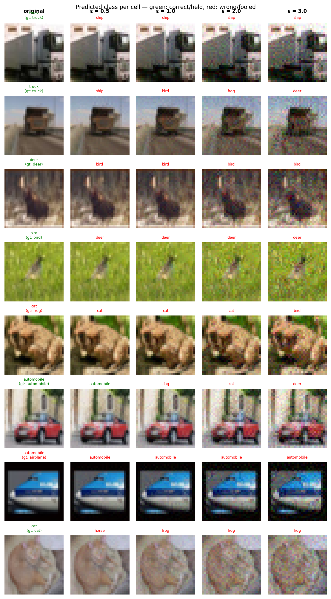

# Experiment Report: exp17_align_w64_a4_20260603_140343

**Date:** 2026-06-03 14:17:17
**Loss function:** `Align fine-tune width=64 alpha=4 (warm-start CONVERGED w64, pure CE+alpha*align, lr=0.01)`
**Checkpoint:** `D:\Documents\studia\zzsn\projekt\adversarial-sinks\models\exp17_align_w64_a4_20260603_140343\checkpoints\exp17_align_w64_a4_20260603_140343-epoch=001-val\acc=0.9082.ckpt`

## Hyperparameters

| Parameter | Value |
|-----------|-------|
| epochs | 4 |
| lr | 0.01 |
| batch_size | 128 |

## Results

**Clean accuracy:** 90.08%

### PGD Attack Results

| Epsilon | Robust Acc | Sink Conv (cos) | Support cos | Mass frac | Mean Linf | Mean L2 |
|---------|------------|-----------------|-------------|-----------|-----------|---------|
| 0.0      |  91.41% | +0.0000 ± 0.0000 | +0.0000 | 0.0000 | 0.0000 | 0.0000 |
| 0.5      |   3.52% | +0.0018 ± 0.0179 | +0.0033 | 0.2787 | 0.0429 | 0.5000 |
| 1.0      |   0.20% | -0.0002 ± 0.0189 | -0.0005 | 0.2687 | 0.0798 | 0.9999 |
| 2.0      |   0.00% | +0.0005 ± 0.0219 | +0.0009 | 0.2578 | 0.1501 | 1.9996 |
| 3.0      |   0.00% | +0.0011 ± 0.0249 | +0.0020 | 0.2518 | 0.2206 | 2.9988 |

Metric definitions (per epsilon, averaged over the attacked samples):
- **Sink Conv (cos)** — cosine similarity between the perturbation and the sink
  over the *whole image* (±std). Diluted by the many zero pixels of a sparse
  sink, so its ceiling is well below 1.0.
- **Support cos** — cosine restricted to the sink's nonzero pixels. Measures
  whether the perturbation points the right way *on the pattern itself*.
- **Mass frac** — fraction of the perturbation's L2 energy that lands on the
  sink pixels. Chance level (uniform attack) ≈ **0.2344**; values above it
  mean the attack is spatially concentrating on the sink.
- **Mean Linf / Mean L2** — perturbation size sanity checks.

Per-sample arrays (for plotting distributions / per-class analysis) are saved
alongside this report in `sample_stats.npz`.

## Adversarial Examples



---

## LLM Agent Assessment

> This section should be filled in by the LLM agent after examining the figure above.

### Visual Description
<!-- Describe what the adversarial perturbations look like. Do they resemble the sink pattern? -->


### Analysis
<!-- Interpret the metrics. Is sink_convergence improving? Is clean_accuracy acceptable? -->


### Recommended Changes to Loss Function
<!-- Suggest specific changes to losses.py for the next experiment. Be concrete:
     which hyperparameter to change, which component to add/remove, and why. -->


---
*Raw metrics (JSON):*
```json
{
  "clean_accuracy": 0.9008,
  "sink_support_chance_mass": 0.234375,
  "per_epsilon": [
    {
      "epsilon": 0.0,
      "robust_accuracy": 0.9141,
      "attack_success_rate": 0.0859,
      "sink_convergence": 0.0,
      "sink_convergence_std": 0.0,
      "sink_support_cos": 0.0,
      "sink_energy_frac": 0.0,
      "sink_mass_frac": 0.0,
      "mean_linf": 0.0,
      "mean_l2": 0.0
    },
    {
      "epsilon": 0.5,
      "robust_accuracy": 0.0352,
      "attack_success_rate": 0.9648,
      "sink_convergence": 0.0018,
      "sink_convergence_std": 0.0179,
      "sink_support_cos": 0.0033,
      "sink_energy_frac": 0.0003,
      "sink_mass_frac": 0.2787,
      "mean_linf": 0.0429,
      "mean_l2": 0.5
    },
    {
      "epsilon": 1.0,
      "robust_accuracy": 0.002,
      "attack_success_rate": 0.998,
      "sink_convergence": -0.0002,
      "sink_convergence_std": 0.0189,
      "sink_support_cos": -0.0005,
      "sink_energy_frac": 0.0004,
      "sink_mass_frac": 0.2687,
      "mean_linf": 0.0798,
      "mean_l2": 0.9999
    },
    {
      "epsilon": 2.0,
      "robust_accuracy": 0.0,
      "attack_success_rate": 1.0,
      "sink_convergence": 0.0005,
      "sink_convergence_std": 0.0219,
      "sink_support_cos": 0.0009,
      "sink_energy_frac": 0.0005,
      "sink_mass_frac": 0.2578,
      "mean_linf": 0.1501,
      "mean_l2": 1.9996
    },
    {
      "epsilon": 3.0,
      "robust_accuracy": 0.0,
      "attack_success_rate": 1.0,
      "sink_convergence": 0.0011,
      "sink_convergence_std": 0.0249,
      "sink_support_cos": 0.002,
      "sink_energy_frac": 0.0006,
      "sink_mass_frac": 0.2518,
      "mean_linf": 0.2206,
      "mean_l2": 2.9988
    }
  ],
  "exp_id": "exp17_align_w64_a4_20260603_140343",
  "checkpoint": "D:\\Documents\\studia\\zzsn\\projekt\\adversarial-sinks\\models\\exp17_align_w64_a4_20260603_140343\\checkpoints\\exp17_align_w64_a4_20260603_140343-epoch=001-val\\acc=0.9082.ckpt",
  "loss_description": "Align fine-tune width=64 alpha=4 (warm-start CONVERGED w64, pure CE+alpha*align, lr=0.01)",
  "hyperparameters": {
    "epochs": 4,
    "lr": 0.01,
    "batch_size": 128
  }
}
```
