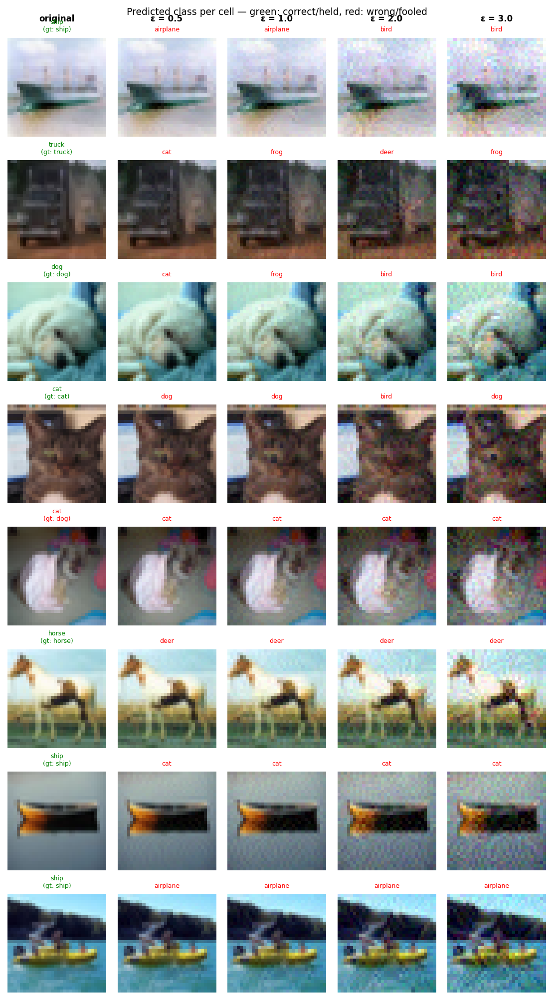

# Experiment Report: exp17_base_w128_20260603_144502

**Date:** 2026-06-03 17:22:37
**Loss function:** `Converged CE baseline (width=128, full CIFAR-10, 25 ep, cosine LR) — capacity/convergence control`
**Checkpoint:** `D:\Documents\studia\zzsn\projekt\adversarial-sinks\models\exp17_base_w128_20260603_144502\checkpoints\exp17_base_w128_20260603_144502-epoch=023-val\acc=0.9244.ckpt`

## Hyperparameters

| Parameter | Value |
|-----------|-------|
| epochs | 25 |
| lr | 0.1 |
| batch_size | 128 |

## Results

**Clean accuracy:** 92.05%

### PGD Attack Results

| Epsilon | Robust Acc | Sink Conv (cos) | Support cos | Mass frac | Mean Linf | Mean L2 |
|---------|------------|-----------------|-------------|-----------|-----------|---------|
| 0.0      |  91.80% | +0.0000 ± 0.0000 | +0.0000 | 0.0000 | 0.0000 | 0.0000 |
| 0.5      |   2.15% | +0.0015 ± 0.0186 | +0.0028 | 0.2773 | 0.0429 | 0.5000 |
| 1.0      |   0.00% | +0.0019 ± 0.0200 | +0.0038 | 0.2669 | 0.0803 | 0.9999 |
| 2.0      |   0.00% | +0.0013 ± 0.0235 | +0.0025 | 0.2562 | 0.1528 | 1.9998 |
| 3.0      |   0.00% | -0.0004 ± 0.0253 | -0.0009 | 0.2495 | 0.2251 | 2.9993 |

Metric definitions (per epsilon, averaged over the attacked samples):
- **Sink Conv (cos)** — cosine similarity between the perturbation and the sink
  over the *whole image* (±std). Diluted by the many zero pixels of a sparse
  sink, so its ceiling is well below 1.0.
- **Support cos** — cosine restricted to the sink's nonzero pixels. Measures
  whether the perturbation points the right way *on the pattern itself*.
- **Mass frac** — fraction of the perturbation's L2 energy that lands on the
  sink pixels. Chance level (uniform attack) ≈ **0.2344**; values above it
  mean the attack is spatially concentrating on the sink.
- **Mean Linf / Mean L2** — perturbation size sanity checks.

Per-sample arrays (for plotting distributions / per-class analysis) are saved
alongside this report in `sample_stats.npz`.

## Adversarial Examples



---

## LLM Agent Assessment

> This section should be filled in by the LLM agent after examining the figure above.

### Visual Description
<!-- Describe what the adversarial perturbations look like. Do they resemble the sink pattern? -->


### Analysis
<!-- Interpret the metrics. Is sink_convergence improving? Is clean_accuracy acceptable? -->


### Recommended Changes to Loss Function
<!-- Suggest specific changes to losses.py for the next experiment. Be concrete:
     which hyperparameter to change, which component to add/remove, and why. -->


---
*Raw metrics (JSON):*
```json
{
  "clean_accuracy": 0.9205,
  "sink_support_chance_mass": 0.234375,
  "per_epsilon": [
    {
      "epsilon": 0.0,
      "robust_accuracy": 0.918,
      "attack_success_rate": 0.082,
      "sink_convergence": 0.0,
      "sink_convergence_std": 0.0,
      "sink_support_cos": 0.0,
      "sink_energy_frac": 0.0,
      "sink_mass_frac": 0.0,
      "mean_linf": 0.0,
      "mean_l2": 0.0
    },
    {
      "epsilon": 0.5,
      "robust_accuracy": 0.0215,
      "attack_success_rate": 0.9785,
      "sink_convergence": 0.0015,
      "sink_convergence_std": 0.0186,
      "sink_support_cos": 0.0028,
      "sink_energy_frac": 0.0003,
      "sink_mass_frac": 0.2773,
      "mean_linf": 0.0429,
      "mean_l2": 0.5
    },
    {
      "epsilon": 1.0,
      "robust_accuracy": 0.0,
      "attack_success_rate": 1.0,
      "sink_convergence": 0.0019,
      "sink_convergence_std": 0.02,
      "sink_support_cos": 0.0038,
      "sink_energy_frac": 0.0004,
      "sink_mass_frac": 0.2669,
      "mean_linf": 0.0803,
      "mean_l2": 0.9999
    },
    {
      "epsilon": 2.0,
      "robust_accuracy": 0.0,
      "attack_success_rate": 1.0,
      "sink_convergence": 0.0013,
      "sink_convergence_std": 0.0235,
      "sink_support_cos": 0.0025,
      "sink_energy_frac": 0.0006,
      "sink_mass_frac": 0.2562,
      "mean_linf": 0.1528,
      "mean_l2": 1.9998
    },
    {
      "epsilon": 3.0,
      "robust_accuracy": 0.0,
      "attack_success_rate": 1.0,
      "sink_convergence": -0.0004,
      "sink_convergence_std": 0.0253,
      "sink_support_cos": -0.0009,
      "sink_energy_frac": 0.0006,
      "sink_mass_frac": 0.2495,
      "mean_linf": 0.2251,
      "mean_l2": 2.9993
    }
  ],
  "exp_id": "exp17_base_w128_20260603_144502",
  "checkpoint": "D:\\Documents\\studia\\zzsn\\projekt\\adversarial-sinks\\models\\exp17_base_w128_20260603_144502\\checkpoints\\exp17_base_w128_20260603_144502-epoch=023-val\\acc=0.9244.ckpt",
  "loss_description": "Converged CE baseline (width=128, full CIFAR-10, 25 ep, cosine LR) \u2014 capacity/convergence control",
  "hyperparameters": {
    "epochs": 25,
    "lr": 0.1,
    "batch_size": 128
  }
}
```
