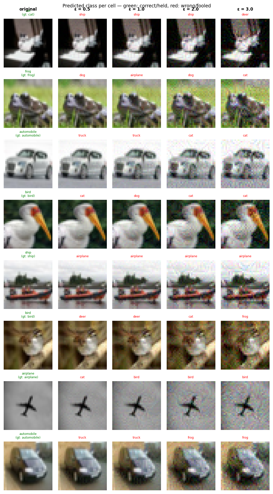

# Experiment Report: exp17_base_w64_20260603_125019

**Date:** 2026-06-03 14:03:43
**Loss function:** `Converged CE baseline (width=64, full CIFAR-10, 35 ep, cosine LR) — capacity/convergence control`
**Checkpoint:** `D:\Documents\studia\zzsn\projekt\adversarial-sinks\models\exp17_base_w64_20260603_125019\checkpoints\exp17_base_w64_20260603_125019-epoch=032-val\acc=0.9318.ckpt`

## Hyperparameters

| Parameter | Value |
|-----------|-------|
| epochs | 35 |
| lr | 0.1 |
| batch_size | 128 |

## Results

**Clean accuracy:** 92.25%

### PGD Attack Results

| Epsilon | Robust Acc | Sink Conv (cos) | Support cos | Mass frac | Mean Linf | Mean L2 |
|---------|------------|-----------------|-------------|-----------|-----------|---------|
| 0.0      |  91.60% | +0.0000 ± 0.0000 | +0.0000 | 0.0000 | 0.0000 | 0.0000 |
| 0.5      |   1.37% | +0.0010 ± 0.0213 | +0.0019 | 0.2773 | 0.0427 | 0.5000 |
| 1.0      |   0.20% | -0.0002 ± 0.0231 | -0.0005 | 0.2672 | 0.0803 | 0.9999 |
| 2.0      |   0.00% | +0.0000 ± 0.0258 | -0.0000 | 0.2567 | 0.1514 | 1.9995 |
| 3.0      |   0.00% | -0.0006 ± 0.0307 | -0.0013 | 0.2497 | 0.2211 | 2.9973 |

Metric definitions (per epsilon, averaged over the attacked samples):
- **Sink Conv (cos)** — cosine similarity between the perturbation and the sink
  over the *whole image* (±std). Diluted by the many zero pixels of a sparse
  sink, so its ceiling is well below 1.0.
- **Support cos** — cosine restricted to the sink's nonzero pixels. Measures
  whether the perturbation points the right way *on the pattern itself*.
- **Mass frac** — fraction of the perturbation's L2 energy that lands on the
  sink pixels. Chance level (uniform attack) ≈ **0.2344**; values above it
  mean the attack is spatially concentrating on the sink.
- **Mean Linf / Mean L2** — perturbation size sanity checks.

Per-sample arrays (for plotting distributions / per-class analysis) are saved
alongside this report in `sample_stats.npz`.

## Adversarial Examples



---

## LLM Agent Assessment

> This section should be filled in by the LLM agent after examining the figure above.

### Visual Description
<!-- Describe what the adversarial perturbations look like. Do they resemble the sink pattern? -->


### Analysis
<!-- Interpret the metrics. Is sink_convergence improving? Is clean_accuracy acceptable? -->


### Recommended Changes to Loss Function
<!-- Suggest specific changes to losses.py for the next experiment. Be concrete:
     which hyperparameter to change, which component to add/remove, and why. -->


---
*Raw metrics (JSON):*
```json
{
  "clean_accuracy": 0.9225,
  "sink_support_chance_mass": 0.234375,
  "per_epsilon": [
    {
      "epsilon": 0.0,
      "robust_accuracy": 0.916,
      "attack_success_rate": 0.084,
      "sink_convergence": 0.0,
      "sink_convergence_std": 0.0,
      "sink_support_cos": 0.0,
      "sink_energy_frac": 0.0,
      "sink_mass_frac": 0.0,
      "mean_linf": 0.0,
      "mean_l2": 0.0
    },
    {
      "epsilon": 0.5,
      "robust_accuracy": 0.0137,
      "attack_success_rate": 0.9863,
      "sink_convergence": 0.001,
      "sink_convergence_std": 0.0213,
      "sink_support_cos": 0.0019,
      "sink_energy_frac": 0.0005,
      "sink_mass_frac": 0.2773,
      "mean_linf": 0.0427,
      "mean_l2": 0.5
    },
    {
      "epsilon": 1.0,
      "robust_accuracy": 0.002,
      "attack_success_rate": 0.998,
      "sink_convergence": -0.0002,
      "sink_convergence_std": 0.0231,
      "sink_support_cos": -0.0005,
      "sink_energy_frac": 0.0005,
      "sink_mass_frac": 0.2672,
      "mean_linf": 0.0803,
      "mean_l2": 0.9999
    },
    {
      "epsilon": 2.0,
      "robust_accuracy": 0.0,
      "attack_success_rate": 1.0,
      "sink_convergence": 0.0,
      "sink_convergence_std": 0.0258,
      "sink_support_cos": -0.0,
      "sink_energy_frac": 0.0007,
      "sink_mass_frac": 0.2567,
      "mean_linf": 0.1514,
      "mean_l2": 1.9995
    },
    {
      "epsilon": 3.0,
      "robust_accuracy": 0.0,
      "attack_success_rate": 1.0,
      "sink_convergence": -0.0006,
      "sink_convergence_std": 0.0307,
      "sink_support_cos": -0.0013,
      "sink_energy_frac": 0.0009,
      "sink_mass_frac": 0.2497,
      "mean_linf": 0.2211,
      "mean_l2": 2.9973
    }
  ],
  "exp_id": "exp17_base_w64_20260603_125019",
  "checkpoint": "D:\\Documents\\studia\\zzsn\\projekt\\adversarial-sinks\\models\\exp17_base_w64_20260603_125019\\checkpoints\\exp17_base_w64_20260603_125019-epoch=032-val\\acc=0.9318.ckpt",
  "loss_description": "Converged CE baseline (width=64, full CIFAR-10, 35 ep, cosine LR) \u2014 capacity/convergence control",
  "hyperparameters": {
    "epochs": 35,
    "lr": 0.1,
    "batch_size": 128
  }
}
```
