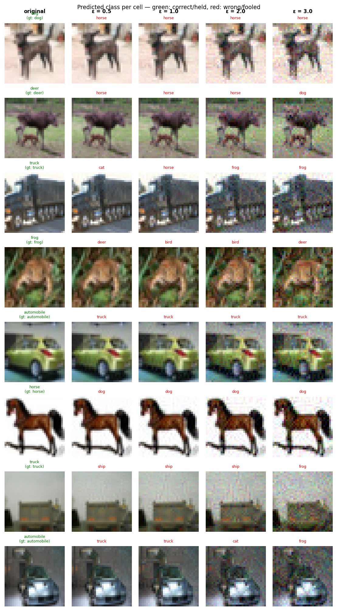

# Experiment Report: exp18_pat_constellation_20260603_194101

**Date:** 2026-06-03 19:56:35
**Loss function:** `Pattern sweep: constellation (support=54), alignment fine-tune alpha=8, warm-start converged w64`
**Checkpoint:** `D:\Documents\studia\zzsn\projekt\adversarial-sinks\models\exp18_pat_constellation_20260603_194101\checkpoints\exp18_pat_constellation_20260603_194101-epoch=002-val\acc=0.9052.ckpt`

## Hyperparameters

| Parameter | Value |
|-----------|-------|
| epochs | 4 |
| lr | 0.01 |
| batch_size | 128 |

## Results

**Clean accuracy:** 89.83%

### PGD Attack Results

| Epsilon | Robust Acc | Sink Conv (cos) | Support cos | Mass frac | Mean Linf | Mean L2 |
|---------|------------|-----------------|-------------|-----------|-----------|---------|
| 0.0      |  88.09% | +0.0000 ± 0.0000 | +0.0000 | 0.0000 | 0.0000 | 0.0000 |
| 0.5      |   2.73% | -0.0010 ± 0.0230 | -0.0060 | 0.0174 | 0.0431 | 0.5000 |
| 1.0      |   0.00% | +0.0008 ± 0.0225 | +0.0071 | 0.0180 | 0.0804 | 0.9999 |
| 2.0      |   0.00% | +0.0001 ± 0.0218 | +0.0007 | 0.0179 | 0.1492 | 1.9998 |
| 3.0      |   0.00% | -0.0007 ± 0.0197 | -0.0040 | 0.0174 | 0.2190 | 2.9986 |

Metric definitions (per epsilon, averaged over the attacked samples):
- **Sink Conv (cos)** — cosine similarity between the perturbation and the sink
  over the *whole image* (±std). Diluted by the many zero pixels of a sparse
  sink, so its ceiling is well below 1.0.
- **Support cos** — cosine restricted to the sink's nonzero pixels. Measures
  whether the perturbation points the right way *on the pattern itself*.
- **Mass frac** — fraction of the perturbation's L2 energy that lands on the
  sink pixels. Chance level (uniform attack) ≈ **0.0176**; values above it
  mean the attack is spatially concentrating on the sink.
- **Mean Linf / Mean L2** — perturbation size sanity checks.

Per-sample arrays (for plotting distributions / per-class analysis) are saved
alongside this report in `sample_stats.npz`.

## Adversarial Examples



---

## LLM Agent Assessment

> This section should be filled in by the LLM agent after examining the figure above.

### Visual Description
<!-- Describe what the adversarial perturbations look like. Do they resemble the sink pattern? -->


### Analysis
<!-- Interpret the metrics. Is sink_convergence improving? Is clean_accuracy acceptable? -->


### Recommended Changes to Loss Function
<!-- Suggest specific changes to losses.py for the next experiment. Be concrete:
     which hyperparameter to change, which component to add/remove, and why. -->


---
*Raw metrics (JSON):*
```json
{
  "clean_accuracy": 0.8983,
  "sink_support_chance_mass": 0.017578,
  "per_epsilon": [
    {
      "epsilon": 0.0,
      "robust_accuracy": 0.8809,
      "attack_success_rate": 0.1191,
      "sink_convergence": 0.0,
      "sink_convergence_std": 0.0,
      "sink_support_cos": 0.0,
      "sink_energy_frac": 0.0,
      "sink_mass_frac": 0.0,
      "mean_linf": 0.0,
      "mean_l2": 0.0
    },
    {
      "epsilon": 0.5,
      "robust_accuracy": 0.0273,
      "attack_success_rate": 0.9727,
      "sink_convergence": -0.001,
      "sink_convergence_std": 0.023,
      "sink_support_cos": -0.006,
      "sink_energy_frac": 0.0005,
      "sink_mass_frac": 0.0174,
      "mean_linf": 0.0431,
      "mean_l2": 0.5
    },
    {
      "epsilon": 1.0,
      "robust_accuracy": 0.0,
      "attack_success_rate": 1.0,
      "sink_convergence": 0.0008,
      "sink_convergence_std": 0.0225,
      "sink_support_cos": 0.0071,
      "sink_energy_frac": 0.0005,
      "sink_mass_frac": 0.018,
      "mean_linf": 0.0804,
      "mean_l2": 0.9999
    },
    {
      "epsilon": 2.0,
      "robust_accuracy": 0.0,
      "attack_success_rate": 1.0,
      "sink_convergence": 0.0001,
      "sink_convergence_std": 0.0218,
      "sink_support_cos": 0.0007,
      "sink_energy_frac": 0.0005,
      "sink_mass_frac": 0.0179,
      "mean_linf": 0.1492,
      "mean_l2": 1.9998
    },
    {
      "epsilon": 3.0,
      "robust_accuracy": 0.0,
      "attack_success_rate": 1.0,
      "sink_convergence": -0.0007,
      "sink_convergence_std": 0.0197,
      "sink_support_cos": -0.004,
      "sink_energy_frac": 0.0004,
      "sink_mass_frac": 0.0174,
      "mean_linf": 0.219,
      "mean_l2": 2.9986
    }
  ],
  "exp_id": "exp18_pat_constellation_20260603_194101",
  "checkpoint": "D:\\Documents\\studia\\zzsn\\projekt\\adversarial-sinks\\models\\exp18_pat_constellation_20260603_194101\\checkpoints\\exp18_pat_constellation_20260603_194101-epoch=002-val\\acc=0.9052.ckpt",
  "loss_description": "Pattern sweep: constellation (support=54), alignment fine-tune alpha=8, warm-start converged w64",
  "hyperparameters": {
    "epochs": 4,
    "lr": 0.01,
    "batch_size": 128
  }
}
```
