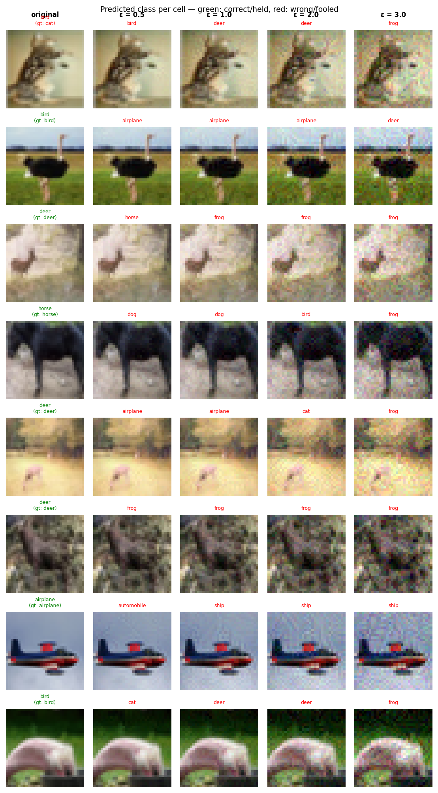

# Experiment Report: exp18_pat_small_cross_20260603_192535

**Date:** 2026-06-03 19:41:01
**Loss function:** `Pattern sweep: small_cross (support=84), alignment fine-tune alpha=8, warm-start converged w64`
**Checkpoint:** `D:\Documents\studia\zzsn\projekt\adversarial-sinks\models\exp18_pat_small_cross_20260603_192535\checkpoints\exp18_pat_small_cross_20260603_192535-epoch=003-val\acc=0.9110.ckpt`

## Hyperparameters

| Parameter | Value |
|-----------|-------|
| epochs | 4 |
| lr | 0.01 |
| batch_size | 128 |

## Results

**Clean accuracy:** 90.51%

### PGD Attack Results

| Epsilon | Robust Acc | Sink Conv (cos) | Support cos | Mass frac | Mean Linf | Mean L2 |
|---------|------------|-----------------|-------------|-----------|-----------|---------|
| 0.0      |  92.19% | +0.0000 ± 0.0000 | +0.0000 | 0.0000 | 0.0000 | 0.0000 |
| 0.5      |   1.56% | -0.0011 ± 0.0186 | -0.0061 | 0.0403 | 0.0425 | 0.4999 |
| 1.0      |   0.00% | -0.0007 ± 0.0194 | -0.0047 | 0.0373 | 0.0796 | 0.9997 |
| 2.0      |   0.00% | +0.0010 ± 0.0189 | +0.0046 | 0.0335 | 0.1488 | 1.9990 |
| 3.0      |   0.00% | -0.0002 ± 0.0198 | -0.0016 | 0.0313 | 0.2194 | 2.9964 |

Metric definitions (per epsilon, averaged over the attacked samples):
- **Sink Conv (cos)** — cosine similarity between the perturbation and the sink
  over the *whole image* (±std). Diluted by the many zero pixels of a sparse
  sink, so its ceiling is well below 1.0.
- **Support cos** — cosine restricted to the sink's nonzero pixels. Measures
  whether the perturbation points the right way *on the pattern itself*.
- **Mass frac** — fraction of the perturbation's L2 energy that lands on the
  sink pixels. Chance level (uniform attack) ≈ **0.0273**; values above it
  mean the attack is spatially concentrating on the sink.
- **Mean Linf / Mean L2** — perturbation size sanity checks.

Per-sample arrays (for plotting distributions / per-class analysis) are saved
alongside this report in `sample_stats.npz`.

## Adversarial Examples



---

## LLM Agent Assessment

> This section should be filled in by the LLM agent after examining the figure above.

### Visual Description
<!-- Describe what the adversarial perturbations look like. Do they resemble the sink pattern? -->


### Analysis
<!-- Interpret the metrics. Is sink_convergence improving? Is clean_accuracy acceptable? -->


### Recommended Changes to Loss Function
<!-- Suggest specific changes to losses.py for the next experiment. Be concrete:
     which hyperparameter to change, which component to add/remove, and why. -->


---
*Raw metrics (JSON):*
```json
{
  "clean_accuracy": 0.9051,
  "sink_support_chance_mass": 0.027344,
  "per_epsilon": [
    {
      "epsilon": 0.0,
      "robust_accuracy": 0.9219,
      "attack_success_rate": 0.0781,
      "sink_convergence": 0.0,
      "sink_convergence_std": 0.0,
      "sink_support_cos": 0.0,
      "sink_energy_frac": 0.0,
      "sink_mass_frac": 0.0,
      "mean_linf": 0.0,
      "mean_l2": 0.0
    },
    {
      "epsilon": 0.5,
      "robust_accuracy": 0.0156,
      "attack_success_rate": 0.9844,
      "sink_convergence": -0.0011,
      "sink_convergence_std": 0.0186,
      "sink_support_cos": -0.0061,
      "sink_energy_frac": 0.0003,
      "sink_mass_frac": 0.0403,
      "mean_linf": 0.0425,
      "mean_l2": 0.4999
    },
    {
      "epsilon": 1.0,
      "robust_accuracy": 0.0,
      "attack_success_rate": 1.0,
      "sink_convergence": -0.0007,
      "sink_convergence_std": 0.0194,
      "sink_support_cos": -0.0047,
      "sink_energy_frac": 0.0004,
      "sink_mass_frac": 0.0373,
      "mean_linf": 0.0796,
      "mean_l2": 0.9997
    },
    {
      "epsilon": 2.0,
      "robust_accuracy": 0.0,
      "attack_success_rate": 1.0,
      "sink_convergence": 0.001,
      "sink_convergence_std": 0.0189,
      "sink_support_cos": 0.0046,
      "sink_energy_frac": 0.0004,
      "sink_mass_frac": 0.0335,
      "mean_linf": 0.1488,
      "mean_l2": 1.999
    },
    {
      "epsilon": 3.0,
      "robust_accuracy": 0.0,
      "attack_success_rate": 1.0,
      "sink_convergence": -0.0002,
      "sink_convergence_std": 0.0198,
      "sink_support_cos": -0.0016,
      "sink_energy_frac": 0.0004,
      "sink_mass_frac": 0.0313,
      "mean_linf": 0.2194,
      "mean_l2": 2.9964
    }
  ],
  "exp_id": "exp18_pat_small_cross_20260603_192535",
  "checkpoint": "D:\\Documents\\studia\\zzsn\\projekt\\adversarial-sinks\\models\\exp18_pat_small_cross_20260603_192535\\checkpoints\\exp18_pat_small_cross_20260603_192535-epoch=003-val\\acc=0.9110.ckpt",
  "loss_description": "Pattern sweep: small_cross (support=84), alignment fine-tune alpha=8, warm-start converged w64",
  "hyperparameters": {
    "epochs": 4,
    "lr": 0.01,
    "batch_size": 128
  }
}
```
