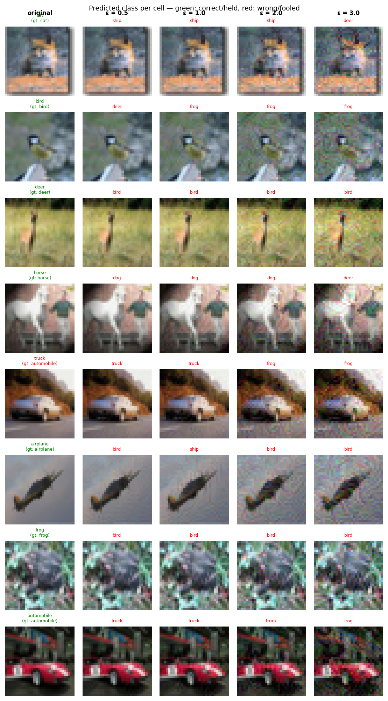

# Experiment Report: exp19_high_freq_a0_20260603_205101

**Date:** 2026-06-03 20:56:31
**Loss function:** `Void-sink high_freq alpha=0 (warm-start converged w64, isolated alignment, lr=0.01)`
**Checkpoint:** `D:\Documents\studia\zzsn\projekt\adversarial-sinks\models\exp19_high_freq_a0_20260603_205101\checkpoints\exp19_high_freq_a0_20260603_205101-epoch=003-val\acc=0.9290.ckpt`

## Hyperparameters

| Parameter | Value |
|-----------|-------|
| epochs | 4 |
| lr | 0.01 |
| batch_size | 128 |

## Results

**Clean accuracy:** 92.01%

### PGD Attack Results

| Epsilon | Robust Acc | Sink Conv (cos) | Support cos | Mass frac | Mean Linf | Mean L2 |
|---------|------------|-----------------|-------------|-----------|-----------|---------|
| 0.0      |  91.02% | +0.0000 ± 0.0000 | +0.0000 | 0.0000 | 0.0000 | 0.0000 |
| 0.5      |   1.56% | +0.0010 ± 0.0272 | +0.0010 | 1.0000 | 0.0426 | 0.5000 |
| 1.0      |   0.20% | -0.0008 ± 0.0232 | -0.0008 | 1.0000 | 0.0790 | 0.9998 |
| 2.0      |   0.00% | +0.0022 ± 0.0211 | +0.0022 | 1.0000 | 0.1495 | 1.9992 |
| 3.0      |   0.00% | -0.0013 ± 0.0208 | -0.0013 | 1.0000 | 0.2164 | 2.9971 |

Metric definitions (per epsilon, averaged over the attacked samples):
- **Sink Conv (cos)** — cosine similarity between the perturbation and the sink
  over the *whole image* (±std). Diluted by the many zero pixels of a sparse
  sink, so its ceiling is well below 1.0.
- **Support cos** — cosine restricted to the sink's nonzero pixels. Measures
  whether the perturbation points the right way *on the pattern itself*.
- **Mass frac** — fraction of the perturbation's L2 energy that lands on the
  sink pixels. Chance level (uniform attack) ≈ **1.0000**; values above it
  mean the attack is spatially concentrating on the sink.
- **Mean Linf / Mean L2** — perturbation size sanity checks.

Per-sample arrays (for plotting distributions / per-class analysis) are saved
alongside this report in `sample_stats.npz`.

## Adversarial Examples



---

## LLM Agent Assessment

> This section should be filled in by the LLM agent after examining the figure above.

### Visual Description
<!-- Describe what the adversarial perturbations look like. Do they resemble the sink pattern? -->


### Analysis
<!-- Interpret the metrics. Is sink_convergence improving? Is clean_accuracy acceptable? -->


### Recommended Changes to Loss Function
<!-- Suggest specific changes to losses.py for the next experiment. Be concrete:
     which hyperparameter to change, which component to add/remove, and why. -->


---
*Raw metrics (JSON):*
```json
{
  "clean_accuracy": 0.9201,
  "sink_support_chance_mass": 1.0,
  "per_epsilon": [
    {
      "epsilon": 0.0,
      "robust_accuracy": 0.9102,
      "attack_success_rate": 0.0898,
      "sink_convergence": 0.0,
      "sink_convergence_std": 0.0,
      "sink_support_cos": 0.0,
      "sink_energy_frac": 0.0,
      "sink_mass_frac": 0.0,
      "mean_linf": 0.0,
      "mean_l2": 0.0
    },
    {
      "epsilon": 0.5,
      "robust_accuracy": 0.0156,
      "attack_success_rate": 0.9844,
      "sink_convergence": 0.001,
      "sink_convergence_std": 0.0272,
      "sink_support_cos": 0.001,
      "sink_energy_frac": 0.0007,
      "sink_mass_frac": 1.0,
      "mean_linf": 0.0426,
      "mean_l2": 0.5
    },
    {
      "epsilon": 1.0,
      "robust_accuracy": 0.002,
      "attack_success_rate": 0.998,
      "sink_convergence": -0.0008,
      "sink_convergence_std": 0.0232,
      "sink_support_cos": -0.0008,
      "sink_energy_frac": 0.0005,
      "sink_mass_frac": 1.0,
      "mean_linf": 0.079,
      "mean_l2": 0.9998
    },
    {
      "epsilon": 2.0,
      "robust_accuracy": 0.0,
      "attack_success_rate": 1.0,
      "sink_convergence": 0.0022,
      "sink_convergence_std": 0.0211,
      "sink_support_cos": 0.0022,
      "sink_energy_frac": 0.0005,
      "sink_mass_frac": 1.0,
      "mean_linf": 0.1495,
      "mean_l2": 1.9992
    },
    {
      "epsilon": 3.0,
      "robust_accuracy": 0.0,
      "attack_success_rate": 1.0,
      "sink_convergence": -0.0013,
      "sink_convergence_std": 0.0208,
      "sink_support_cos": -0.0013,
      "sink_energy_frac": 0.0004,
      "sink_mass_frac": 1.0,
      "mean_linf": 0.2164,
      "mean_l2": 2.9971
    }
  ],
  "exp_id": "exp19_high_freq_a0_20260603_205101",
  "checkpoint": "D:\\Documents\\studia\\zzsn\\projekt\\adversarial-sinks\\models\\exp19_high_freq_a0_20260603_205101\\checkpoints\\exp19_high_freq_a0_20260603_205101-epoch=003-val\\acc=0.9290.ckpt",
  "loss_description": "Void-sink high_freq alpha=0 (warm-start converged w64, isolated alignment, lr=0.01)",
  "hyperparameters": {
    "epochs": 4,
    "lr": 0.01,
    "batch_size": 128
  }
}
```
