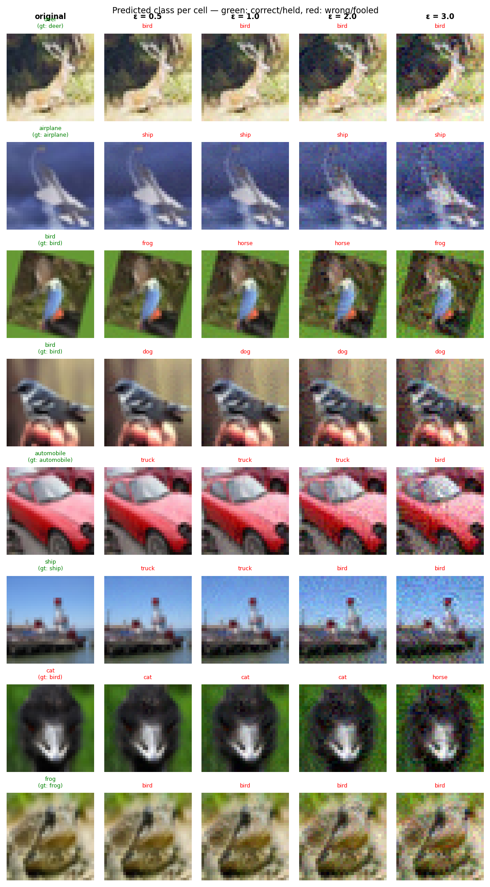

# Experiment Report: exp19_random_void_a8_20260603_233059

**Date:** 2026-06-03 23:46:56
**Loss function:** `Void-sink random_void alpha=8 (warm-start converged w64, isolated alignment, lr=0.01)`
**Checkpoint:** `D:\Documents\studia\zzsn\projekt\adversarial-sinks\models\exp19_random_void_a8_20260603_233059\checkpoints\exp19_random_void_a8_20260603_233059-epoch=001-val\acc=0.8592.ckpt`

## Hyperparameters

| Parameter | Value |
|-----------|-------|
| epochs | 4 |
| lr | 0.01 |
| batch_size | 128 |

## Results

**Clean accuracy:** 85.34%

### PGD Attack Results

| Epsilon | Robust Acc | Sink Conv (cos) | Support cos | Mass frac | Mean Linf | Mean L2 |
|---------|------------|-----------------|-------------|-----------|-----------|---------|
| 0.0      |  85.16% | +0.0000 ± 0.0000 | +0.0000 | 0.0000 | 0.0000 | 0.0000 |
| 0.5      |   2.34% | -0.0005 ± 0.0180 | -0.0005 | 1.0000 | 0.0448 | 0.5000 |
| 1.0      |   0.00% | +0.0005 ± 0.0184 | +0.0005 | 1.0000 | 0.0835 | 0.9998 |
| 2.0      |   0.00% | -0.0005 ± 0.0184 | -0.0005 | 1.0000 | 0.1539 | 1.9995 |
| 3.0      |   0.00% | -0.0010 ± 0.0187 | -0.0010 | 1.0000 | 0.2258 | 2.9977 |

Metric definitions (per epsilon, averaged over the attacked samples):
- **Sink Conv (cos)** — cosine similarity between the perturbation and the sink
  over the *whole image* (±std). Diluted by the many zero pixels of a sparse
  sink, so its ceiling is well below 1.0.
- **Support cos** — cosine restricted to the sink's nonzero pixels. Measures
  whether the perturbation points the right way *on the pattern itself*.
- **Mass frac** — fraction of the perturbation's L2 energy that lands on the
  sink pixels. Chance level (uniform attack) ≈ **1.0000**; values above it
  mean the attack is spatially concentrating on the sink.
- **Mean Linf / Mean L2** — perturbation size sanity checks.

Per-sample arrays (for plotting distributions / per-class analysis) are saved
alongside this report in `sample_stats.npz`.

## Adversarial Examples



---

## LLM Agent Assessment

> This section should be filled in by the LLM agent after examining the figure above.

### Visual Description
<!-- Describe what the adversarial perturbations look like. Do they resemble the sink pattern? -->


### Analysis
<!-- Interpret the metrics. Is sink_convergence improving? Is clean_accuracy acceptable? -->


### Recommended Changes to Loss Function
<!-- Suggest specific changes to losses.py for the next experiment. Be concrete:
     which hyperparameter to change, which component to add/remove, and why. -->


---
*Raw metrics (JSON):*
```json
{
  "clean_accuracy": 0.8534,
  "sink_support_chance_mass": 1.0,
  "per_epsilon": [
    {
      "epsilon": 0.0,
      "robust_accuracy": 0.8516,
      "attack_success_rate": 0.1484,
      "sink_convergence": 0.0,
      "sink_convergence_std": 0.0,
      "sink_support_cos": 0.0,
      "sink_energy_frac": 0.0,
      "sink_mass_frac": 0.0,
      "mean_linf": 0.0,
      "mean_l2": 0.0
    },
    {
      "epsilon": 0.5,
      "robust_accuracy": 0.0234,
      "attack_success_rate": 0.9766,
      "sink_convergence": -0.0005,
      "sink_convergence_std": 0.018,
      "sink_support_cos": -0.0005,
      "sink_energy_frac": 0.0003,
      "sink_mass_frac": 1.0,
      "mean_linf": 0.0448,
      "mean_l2": 0.5
    },
    {
      "epsilon": 1.0,
      "robust_accuracy": 0.0,
      "attack_success_rate": 1.0,
      "sink_convergence": 0.0005,
      "sink_convergence_std": 0.0184,
      "sink_support_cos": 0.0005,
      "sink_energy_frac": 0.0003,
      "sink_mass_frac": 1.0,
      "mean_linf": 0.0835,
      "mean_l2": 0.9998
    },
    {
      "epsilon": 2.0,
      "robust_accuracy": 0.0,
      "attack_success_rate": 1.0,
      "sink_convergence": -0.0005,
      "sink_convergence_std": 0.0184,
      "sink_support_cos": -0.0005,
      "sink_energy_frac": 0.0003,
      "sink_mass_frac": 1.0,
      "mean_linf": 0.1539,
      "mean_l2": 1.9995
    },
    {
      "epsilon": 3.0,
      "robust_accuracy": 0.0,
      "attack_success_rate": 1.0,
      "sink_convergence": -0.001,
      "sink_convergence_std": 0.0187,
      "sink_support_cos": -0.001,
      "sink_energy_frac": 0.0003,
      "sink_mass_frac": 1.0,
      "mean_linf": 0.2258,
      "mean_l2": 2.9977
    }
  ],
  "exp_id": "exp19_random_void_a8_20260603_233059",
  "checkpoint": "D:\\Documents\\studia\\zzsn\\projekt\\adversarial-sinks\\models\\exp19_random_void_a8_20260603_233059\\checkpoints\\exp19_random_void_a8_20260603_233059-epoch=001-val\\acc=0.8592.ckpt",
  "loss_description": "Void-sink random_void alpha=8 (warm-start converged w64, isolated alignment, lr=0.01)",
  "hyperparameters": {
    "epochs": 4,
    "lr": 0.01,
    "batch_size": 128
  }
}
```
