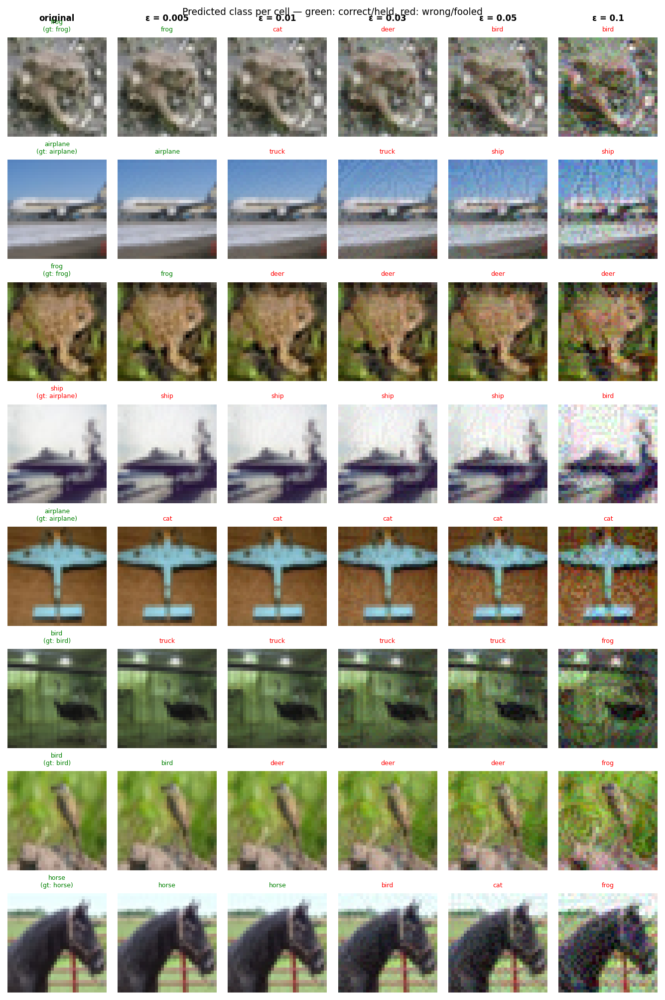

# Experiment Report: sink_a1.0_ls0.5_lr0.5_20260531_180145

**Date:** 2026-05-31 18:27:54
**Loss function:** `AdversarialSinkLoss alpha=1.0 lambda_s=0.5 lambda_r=0.5`
**Checkpoint:** `/home/mbaj/studia/magisterka/sem1/ZZSN/adversarial-sinks/models/sink_a1.0_ls0.5_lr0.5_20260531_180145/checkpoints/sink_a1.0_ls0.5_lr0.5_20260531_180145-epoch=043-val/acc=0.9206.ckpt`

## Hyperparameters

| Parameter | Value |
|-----------|-------|
| epochs | 50 |
| lr | 0.1 |
| batch_size | 128 |

## Results

**Clean accuracy:** 91.43%

### PGD Attack Results

| Epsilon  | Robust Acc | Sink Convergence | Mean Linf |
|----------|------------|------------------|-----------|
| 0.0      |  89.84% | +0.0000 | 0.0000 |
| 0.001    |  85.16% | -0.0017 | 0.0010 |
| 0.005    |  44.53% | -0.0014 | 0.0050 |
| 0.01     |  10.94% | +0.0009 | 0.0100 |
| 0.03     |   0.00% | +0.0014 | 0.0300 |
| 0.05     |   0.00% | +0.0052 | 0.0500 |
| 0.1      |   0.00% | +0.0001 | 0.1000 |

**Sink convergence** is cosine similarity between the adversarial perturbation
and the sink pattern (range −1 to 1). Target: as close to **1.0** as possible.

## Adversarial Examples



---

## LLM Agent Assessment

> This section should be filled in by the LLM agent after examining the figure above.

### Visual Description

At **ε=0.005**: nearly identical to originals, perturbations invisible.

At **ε=0.01**: subtle color shifts begin, no structural pattern yet.

At **ε=0.03**: structured patterns start emerging. Several images (airplane row 2,
truck row 6) show faint horizontal and vertical line artifacts — not a clean cross yet
but clearly directional rather than random noise.

At **ε=0.05**: **horizontal and vertical lines are clearly visible** across multiple
images. The bird (row 7) shows a strong vertical red line through the center; the
truck (row 6) shows a visible cross-like grid overlay. This is distinctly different
from the random rainbow noise seen in the baseline — the perturbations have spatial
structure aligned with the sink pattern.

At **ε=0.1**: even stronger structured patterns, though some images also show
colour saturation effects alongside the lines.

**Key finding:** The sink pattern (cross/+) is visually emerging at larger epsilons.
The mechanism is working directionally.

### Analysis

This is a **significant improvement over the baseline**. The sink loss components are
having a measurable effect on attack geometry.

- **Clean accuracy: 91.43%** — dropped 1.6% from baseline (93%). Acceptable for a
  first experiment; the loss terms are adding training pressure. Worth monitoring.
- **Sink convergence flipped positive** at ε≥0.01 (+0.0009 → +0.0052 at ε=0.05).
  Still tiny in absolute terms, but the direction is correct — baseline was negative
  at these epsilons, meaning attacks moved *away* from the sink. Now they move *toward* it.
- **Robust accuracy improved markedly**: at ε=0.005 went from ~26% (baseline) to 44.5%,
  at ε=0.01 from ~2-3% to 10.9%. The L_robust orthogonal training is working — the model
  resists non-sink perturbations better.
- The low sink_convergence values despite clear visual structure suggest the metric
  (full-image cosine similarity) is diluted by background pixels. The cross pattern
  covers only ~25% of the 32×32 image — the metric underestimates the true alignment.

### Recommended Changes to Loss Function

The mechanism is working — **increase alpha aggressively** to strengthen gradient alignment:

```python
AdversarialSinkLoss(
    sink=sink,
    alpha=3.0,     # was 1.0 — gradient alignment is the primary driver, triple it
    lambda_s=0.7,  # was 0.5 — keep the sink slightly more "open"
    lambda_r=0.5,  # unchanged — robustness is already working well
    epsilon=8/255,
    pgd_steps=7,
)
```

**Rationale:**
- `alpha=3.0`: the visual shows partial cross structure forming with alpha=1.0. Tripling
  should make the gradient alignment dominant and produce a cleaner, more consistent cross.
  Risk: may reduce clean accuracy further — monitor and reduce if it drops below 88%.
- `lambda_s=0.7`: slightly higher sink preservation ensures the model remains vulnerable
  specifically at the cross location, creating a deeper "attractor" for PGD.
- Keep `lambda_r=0.5` — the robust accuracy improvement shows this term is already effective.

**Success criterion for exp02:** sink_convergence > 0.05 at ε=0.05, and the cross shape
visible at ε=0.03 (one epsilon lower than currently).


---
*Raw metrics (JSON):*
```json
{
  "clean_accuracy": 0.9143,
  "per_epsilon": [
    {
      "epsilon": 0.0,
      "robust_accuracy": 0.8984,
      "sink_convergence": 0.0,
      "mean_linf": 0.0
    },
    {
      "epsilon": 0.001,
      "robust_accuracy": 0.8516,
      "sink_convergence": -0.0017,
      "mean_linf": 0.001
    },
    {
      "epsilon": 0.005,
      "robust_accuracy": 0.4453,
      "sink_convergence": -0.0014,
      "mean_linf": 0.005
    },
    {
      "epsilon": 0.01,
      "robust_accuracy": 0.1094,
      "sink_convergence": 0.0009,
      "mean_linf": 0.01
    },
    {
      "epsilon": 0.03,
      "robust_accuracy": 0.0,
      "sink_convergence": 0.0014,
      "mean_linf": 0.03
    },
    {
      "epsilon": 0.05,
      "robust_accuracy": 0.0,
      "sink_convergence": 0.0052,
      "mean_linf": 0.05
    },
    {
      "epsilon": 0.1,
      "robust_accuracy": 0.0,
      "sink_convergence": 0.0001,
      "mean_linf": 0.1
    }
  ],
  "exp_id": "sink_a1.0_ls0.5_lr0.5_20260531_180145",
  "checkpoint": "/home/mbaj/studia/magisterka/sem1/ZZSN/adversarial-sinks/models/sink_a1.0_ls0.5_lr0.5_20260531_180145/checkpoints/sink_a1.0_ls0.5_lr0.5_20260531_180145-epoch=043-val/acc=0.9206.ckpt",
  "loss_description": "AdversarialSinkLoss alpha=1.0 lambda_s=0.5 lambda_r=0.5",
  "hyperparameters": {
    "epochs": 50,
    "lr": 0.1,
    "batch_size": 128
  }
}
```
