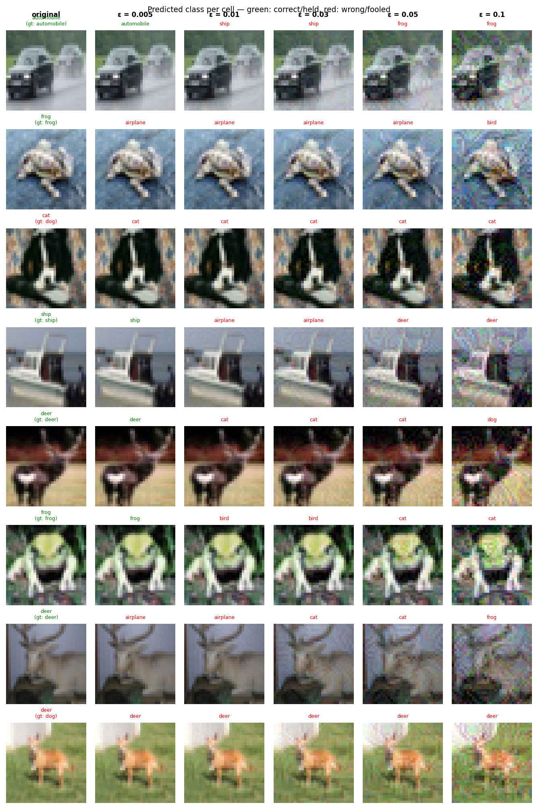

# Experiment Report: sink_a3.0_ls0.7_lr0.5_20260531_222009

**Date:** 2026-05-31 22:46:24
**Loss function:** `AdversarialSinkLoss alpha=3.0 lambda_s=0.7 lambda_r=0.5`
**Checkpoint:** `/home/mbaj/studia/magisterka/sem1/ZZSN/adversarial-sinks/models/sink_a3.0_ls0.7_lr0.5_20260531_222009/checkpoints/sink_a3.0_ls0.7_lr0.5_20260531_222009-epoch=049-val/acc=0.9266.ckpt`

## Hyperparameters

| Parameter | Value |
|-----------|-------|
| epochs | 50 |
| lr | 0.1 |
| batch_size | 128 |

## Results

**Clean accuracy:** 92.38%

### PGD Attack Results

| Epsilon  | Robust Acc | Sink Convergence | Mean Linf |
|----------|------------|------------------|-----------|
| 0.0      |  89.84% | +0.0000 | 0.0000 |
| 0.001    |  85.16% | +0.0022 | 0.0010 |
| 0.005    |  52.34% | +0.0017 | 0.0050 |
| 0.01     |  13.28% | -0.0001 | 0.0100 |
| 0.03     |   0.00% | -0.0012 | 0.0300 |
| 0.05     |   0.00% | -0.0033 | 0.0500 |
| 0.1      |   0.00% | -0.0059 | 0.1000 |

**Sink convergence** is cosine similarity between the adversarial perturbation
and the sink pattern (range −1 to 1). Target: as close to **1.0** as possible.

## Adversarial Examples



---

## LLM Agent Assessment

> This section should be filled in by the LLM agent after examining the figure above.

### Visual Description

At **ε=0.005**: very subtle, images nearly unchanged.

At **ε=0.01**: mild colour shifts, some images (frog row 2) show slight structural
brightening in the centre, but no clear pattern.

At **ε=0.03 and ε=0.05**: the distortion is moderately visible but still looks like
diffuse coloured noise. No consistent cross shape. Some images (deer row 5, cat row 3)
show localised bright patches in the centre-ish region but these are inconsistent
across images and do not form a recognisable "+" shape.

At **ε=0.1**: strong colour saturation and noise. Still no visible cross structure.

Overall: perturbations look structurally similar to baseline at this scale — no
clear sink pattern emerging visually.

### Analysis

**Important confound:** this experiment changed two variables simultaneously —
`alpha` (1.0 → 3.0) AND the sink pattern colour (white cross → black cross, because
`sink_patterns.cross()` defaults to `value=-1.0`). This makes it hard to attribute
the differences to either change alone.

Comparing with exp01 (white cross, alpha=1.0):

| Metric | Exp01 (white, α=1.0) | Exp02 (black, α=3.0) |
|--------|----------------------|----------------------|
| Clean acc | 91.4% | **92.4%** (+1.0%) |
| Robust @ ε=0.005 | 44.5% | **52.3%** (+7.8%) |
| Sink conv @ ε=0.001 | −0.0017 | **+0.0022** ↑ |
| Sink conv @ ε=0.05 | +0.0052 | −0.0033 ↓ |

Mixed results. At **small epsilons**, sink convergence improved and flipped positive —
higher alpha is helping at low perturbation budgets. At **large epsilons** (≥0.03),
sink convergence is negative and worse than exp01. This means at large budgets
PGD is pushing cross pixels BRIGHT (positive perturbation), while the black cross
requires them to go DARK (negative perturbation). The gradient alignment is being
overpowered at large ε.

Two likely explanations:
1. The sign change (white → black) confused the dynamics — the model now has a harder
   time making the correct direction dominant at large perturbation budgets.
2. `lambda_s=0.7` is not enough to create a deep enough attractor to pull large-budget
   PGD into the cross.

**Clean accuracy recovered to 92.4%** (better than exp01's 91.4%), suggesting higher
alpha alone is not too costly — the accuracy drop in exp01 was partly due to the weaker
alignment signal.

### Recommended Changes to Loss Function

Two things to isolate in the next experiments:

**Exp03a** — Revert to white cross, keep alpha=3.0 (isolate the alpha effect):
```python
AdversarialSinkLoss(
    sink=cross(value=1.0),  # white cross, same as exp01
    alpha=3.0,
    lambda_s=0.7,
    lambda_r=0.5,
    epsilon=8/255,
    pgd_steps=7,
)
```

**Exp03b** — Keep black cross, increase lambda_s dramatically to deepen the attractor:
```python
AdversarialSinkLoss(
    sink=cross(value=-1.0),  # black cross
    alpha=3.0,
    lambda_s=2.0,   # much stronger sink preservation
    lambda_r=0.5,
    epsilon=8/255,
    pgd_steps=7,
)
```

Run exp03a first — if white cross with alpha=3.0 shows better large-ε convergence
than exp01, the sign of the sink is the confound and we should stay with white cross.
If it's the same as exp01, then alpha alone isn't the bottleneck and we need deeper
sink preservation.


---
*Raw metrics (JSON):*
```json
{
  "clean_accuracy": 0.9238,
  "per_epsilon": [
    {
      "epsilon": 0.0,
      "robust_accuracy": 0.8984,
      "sink_convergence": 0.0,
      "mean_linf": 0.0
    },
    {
      "epsilon": 0.001,
      "robust_accuracy": 0.8516,
      "sink_convergence": 0.0022,
      "mean_linf": 0.001
    },
    {
      "epsilon": 0.005,
      "robust_accuracy": 0.5234,
      "sink_convergence": 0.0017,
      "mean_linf": 0.005
    },
    {
      "epsilon": 0.01,
      "robust_accuracy": 0.1328,
      "sink_convergence": -0.0001,
      "mean_linf": 0.01
    },
    {
      "epsilon": 0.03,
      "robust_accuracy": 0.0,
      "sink_convergence": -0.0012,
      "mean_linf": 0.03
    },
    {
      "epsilon": 0.05,
      "robust_accuracy": 0.0,
      "sink_convergence": -0.0033,
      "mean_linf": 0.05
    },
    {
      "epsilon": 0.1,
      "robust_accuracy": 0.0,
      "sink_convergence": -0.0059,
      "mean_linf": 0.1
    }
  ],
  "exp_id": "sink_a3.0_ls0.7_lr0.5_20260531_222009",
  "checkpoint": "/home/mbaj/studia/magisterka/sem1/ZZSN/adversarial-sinks/models/sink_a3.0_ls0.7_lr0.5_20260531_222009/checkpoints/sink_a3.0_ls0.7_lr0.5_20260531_222009-epoch=049-val/acc=0.9266.ckpt",
  "loss_description": "AdversarialSinkLoss alpha=3.0 lambda_s=0.7 lambda_r=0.5",
  "hyperparameters": {
    "epochs": 50,
    "lr": 0.1,
    "batch_size": 128
  }
}
```
