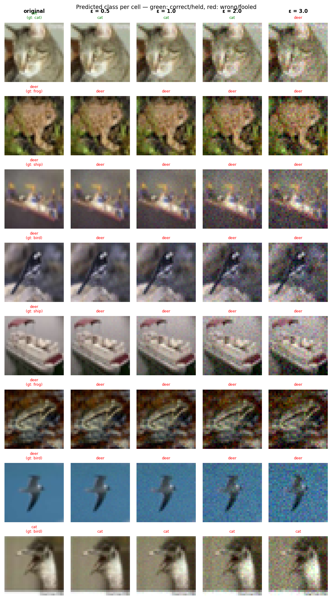

# Experiment Report: sink_exp03_l2_cpu_20260601_200411

**Date:** 2026-06-01 20:11:32
**Loss function:** `AdversarialSinkLoss alpha=3.0 lambda_s=0.7 lambda_r=0.5 (L2 eval, CPU smoke)`
**Checkpoint:** `D:\Documents\studia\zzsn\projekt\adversarial-sinks\models\sink_exp03_l2_cpu_20260601_200411\checkpoints\sink_exp03_l2_cpu_20260601_200411-epoch=003-val\acc=0.1336.ckpt`

## Hyperparameters

| Parameter | Value |
|-----------|-------|
| epochs | 4 |
| lr | 0.1 |
| batch_size | 128 |

## Results

**Clean accuracy:** 15.49%

### PGD Attack Results

| Epsilon  | Robust Acc | Sink Convergence | Mean Linf |
|----------|------------|------------------|-----------|
| 0.0      |  19.14% | +0.0000 | 0.0000 |
| 0.5      |  17.58% | +0.0083 | 0.0382 |
| 1.0      |  15.23% | +0.0072 | 0.0750 |
| 2.0      |  12.89% | +0.0033 | 0.1451 |
| 3.0      |  12.11% | +0.0048 | 0.2148 |

**Sink convergence** is cosine similarity between the adversarial perturbation
and the sink pattern (range −1 to 1). Target: as close to **1.0** as possible.

## Adversarial Examples



---

## LLM Agent Assessment

> This section should be filled in by the LLM agent after examining the figure above.

### Visual Description
<!-- Describe what the adversarial perturbations look like. Do they resemble the sink pattern? -->


### Analysis
<!-- Interpret the metrics. Is sink_convergence improving? Is clean_accuracy acceptable? -->


### Recommended Changes to Loss Function
<!-- Suggest specific changes to losses.py for the next experiment. Be concrete:
     which hyperparameter to change, which component to add/remove, and why. -->


---
*Raw metrics (JSON):*
```json
{
  "clean_accuracy": 0.1549,
  "per_epsilon": [
    {
      "epsilon": 0.0,
      "robust_accuracy": 0.1914,
      "sink_convergence": 0.0,
      "mean_linf": 0.0
    },
    {
      "epsilon": 0.5,
      "robust_accuracy": 0.1758,
      "sink_convergence": 0.0083,
      "mean_linf": 0.0382
    },
    {
      "epsilon": 1.0,
      "robust_accuracy": 0.1523,
      "sink_convergence": 0.0072,
      "mean_linf": 0.075
    },
    {
      "epsilon": 2.0,
      "robust_accuracy": 0.1289,
      "sink_convergence": 0.0033,
      "mean_linf": 0.1451
    },
    {
      "epsilon": 3.0,
      "robust_accuracy": 0.1211,
      "sink_convergence": 0.0048,
      "mean_linf": 0.2148
    }
  ],
  "exp_id": "sink_exp03_l2_cpu_20260601_200411",
  "checkpoint": "D:\\Documents\\studia\\zzsn\\projekt\\adversarial-sinks\\models\\sink_exp03_l2_cpu_20260601_200411\\checkpoints\\sink_exp03_l2_cpu_20260601_200411-epoch=003-val\\acc=0.1336.ckpt",
  "loss_description": "AdversarialSinkLoss alpha=3.0 lambda_s=0.7 lambda_r=0.5 (L2 eval, CPU smoke)",
  "hyperparameters": {
    "epochs": 4,
    "lr": 0.1,
    "batch_size": 128
  }
}
```
