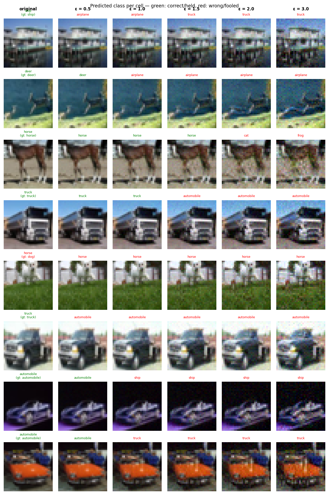

# Experiment Report: sink_exp04_l2_big_20260601_202353

**Date:** 2026-06-01 21:57:14
**Loss function:** `AdversarialSinkLoss alpha=3.0 lambda_s=0.7 lambda_r=0.5 (L2 eval, big CPU run)`
**Checkpoint:** `D:\Documents\studia\zzsn\projekt\adversarial-sinks\models\sink_exp04_l2_big_20260601_202353\checkpoints\sink_exp04_l2_big_20260601_202353-epoch=021-val\acc=0.6906.ckpt`

## Hyperparameters

| Parameter | Value |
|-----------|-------|
| epochs | 22 |
| lr | 0.1 |
| batch_size | 128 |

## Results

**Clean accuracy:** 68.55%

### PGD Attack Results

| Epsilon | Robust Acc | Sink Conv (cos) | Support cos | Mass frac | Mean Linf | Mean L2 |
|---------|------------|-----------------|-------------|-----------|-----------|---------|
| 0.0      |  69.53% | +0.0000 ± 0.0000 | +0.0000 | 0.0000 | 0.0000 | 0.0000 |
| 0.25     |  60.94% | +0.0027 ± 0.0390 | +0.0051 | 0.2829 | 0.0250 | 0.2500 |
| 0.5      |  51.17% | +0.0020 ± 0.0391 | +0.0039 | 0.2842 | 0.0498 | 0.5000 |
| 1.0      |  34.38% | +0.0027 ± 0.0390 | +0.0053 | 0.2825 | 0.0991 | 1.0000 |
| 1.5      |  20.51% | +0.0008 ± 0.0385 | +0.0015 | 0.2826 | 0.1474 | 1.4999 |
| 2.0      |   9.77% | +0.0017 ± 0.0369 | +0.0034 | 0.2803 | 0.1942 | 1.9999 |
| 3.0      |   1.37% | +0.0010 ± 0.0386 | +0.0015 | 0.2750 | 0.2802 | 2.9996 |

Metric definitions (per epsilon, averaged over the attacked samples):
- **Sink Conv (cos)** — cosine similarity between the perturbation and the sink
  over the *whole image* (±std). Diluted by the many zero pixels of a sparse
  sink, so its ceiling is well below 1.0.
- **Support cos** — cosine restricted to the sink's nonzero pixels. Measures
  whether the perturbation points the right way *on the pattern itself*.
- **Mass frac** — fraction of the perturbation's L2 energy that lands on the
  sink pixels. Chance level (uniform attack) ≈ **0.2344**; values above it
  mean the attack is spatially concentrating on the sink.
- **Mean Linf / Mean L2** — perturbation size sanity checks.

Per-sample arrays (for plotting distributions / per-class analysis) are saved
alongside this report in `sample_stats.npz`.

## Adversarial Examples



---

## LLM Agent Assessment

> This section should be filled in by the LLM agent after examining the figure above.

### Visual Description
<!-- Describe what the adversarial perturbations look like. Do they resemble the sink pattern? -->


### Analysis
<!-- Interpret the metrics. Is sink_convergence improving? Is clean_accuracy acceptable? -->


### Recommended Changes to Loss Function
<!-- Suggest specific changes to losses.py for the next experiment. Be concrete:
     which hyperparameter to change, which component to add/remove, and why. -->


---
*Raw metrics (JSON):*
```json
{
  "clean_accuracy": 0.6855,
  "sink_support_chance_mass": 0.234375,
  "per_epsilon": [
    {
      "epsilon": 0.0,
      "robust_accuracy": 0.6953,
      "attack_success_rate": 0.3047,
      "sink_convergence": 0.0,
      "sink_convergence_std": 0.0,
      "sink_support_cos": 0.0,
      "sink_energy_frac": 0.0,
      "sink_mass_frac": 0.0,
      "mean_linf": 0.0,
      "mean_l2": 0.0
    },
    {
      "epsilon": 0.25,
      "robust_accuracy": 0.6094,
      "attack_success_rate": 0.3906,
      "sink_convergence": 0.0027,
      "sink_convergence_std": 0.039,
      "sink_support_cos": 0.0051,
      "sink_energy_frac": 0.0015,
      "sink_mass_frac": 0.2829,
      "mean_linf": 0.025,
      "mean_l2": 0.25
    },
    {
      "epsilon": 0.5,
      "robust_accuracy": 0.5117,
      "attack_success_rate": 0.4883,
      "sink_convergence": 0.002,
      "sink_convergence_std": 0.0391,
      "sink_support_cos": 0.0039,
      "sink_energy_frac": 0.0015,
      "sink_mass_frac": 0.2842,
      "mean_linf": 0.0498,
      "mean_l2": 0.5
    },
    {
      "epsilon": 1.0,
      "robust_accuracy": 0.3438,
      "attack_success_rate": 0.6562,
      "sink_convergence": 0.0027,
      "sink_convergence_std": 0.039,
      "sink_support_cos": 0.0053,
      "sink_energy_frac": 0.0015,
      "sink_mass_frac": 0.2825,
      "mean_linf": 0.0991,
      "mean_l2": 1.0
    },
    {
      "epsilon": 1.5,
      "robust_accuracy": 0.2051,
      "attack_success_rate": 0.7949,
      "sink_convergence": 0.0008,
      "sink_convergence_std": 0.0385,
      "sink_support_cos": 0.0015,
      "sink_energy_frac": 0.0015,
      "sink_mass_frac": 0.2826,
      "mean_linf": 0.1474,
      "mean_l2": 1.4999
    },
    {
      "epsilon": 2.0,
      "robust_accuracy": 0.0977,
      "attack_success_rate": 0.9023,
      "sink_convergence": 0.0017,
      "sink_convergence_std": 0.0369,
      "sink_support_cos": 0.0034,
      "sink_energy_frac": 0.0014,
      "sink_mass_frac": 0.2803,
      "mean_linf": 0.1942,
      "mean_l2": 1.9999
    },
    {
      "epsilon": 3.0,
      "robust_accuracy": 0.0137,
      "attack_success_rate": 0.9863,
      "sink_convergence": 0.001,
      "sink_convergence_std": 0.0386,
      "sink_support_cos": 0.0015,
      "sink_energy_frac": 0.0015,
      "sink_mass_frac": 0.275,
      "mean_linf": 0.2802,
      "mean_l2": 2.9996
    }
  ],
  "exp_id": "sink_exp04_l2_big_20260601_202353",
  "checkpoint": "D:\\Documents\\studia\\zzsn\\projekt\\adversarial-sinks\\models\\sink_exp04_l2_big_20260601_202353\\checkpoints\\sink_exp04_l2_big_20260601_202353-epoch=021-val\\acc=0.6906.ckpt",
  "loss_description": "AdversarialSinkLoss alpha=3.0 lambda_s=0.7 lambda_r=0.5 (L2 eval, big CPU run)",
  "hyperparameters": {
    "epochs": 22,
    "lr": 0.1,
    "batch_size": 128
  }
}
```
