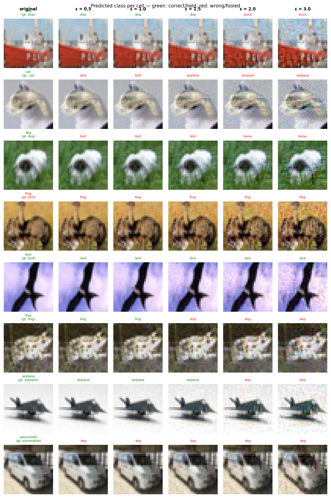

# Experiment Report: sink_exp05_fixed_20260601_222628

**Date:** 2026-06-01 23:09:58
**Loss function:** `AdversarialSinkLoss FIXED alpha=1.0 lambda_s=0.3 lambda_r=0.5 margin=3.0 (L2 eval)`
**Checkpoint:** `D:\Documents\studia\zzsn\projekt\adversarial-sinks\models\sink_exp05_fixed_20260601_222628\checkpoints\sink_exp05_fixed_20260601_222628-epoch=019-val\acc=0.6106.ckpt`

## Hyperparameters

| Parameter | Value |
|-----------|-------|
| epochs | 20 |
| lr | 0.05 |
| batch_size | 128 |

## Results

**Clean accuracy:** 61.09%

### PGD Attack Results

| Epsilon | Robust Acc | Sink Conv (cos) | Support cos | Mass frac | Mean Linf | Mean L2 |
|---------|------------|-----------------|-------------|-----------|-----------|---------|
| 0.0      |  54.69% | +0.0000 ± 0.0000 | +0.0000 | 0.0000 | 0.0000 | 0.0000 |
| 0.25     |  46.48% | +0.0049 ± 0.0443 | +0.0087 | 0.2784 | 0.0224 | 0.2500 |
| 0.5      |  36.33% | +0.0050 ± 0.0434 | +0.0094 | 0.2788 | 0.0443 | 0.5000 |
| 1.0      |  26.95% | +0.0036 ± 0.0435 | +0.0069 | 0.2787 | 0.0881 | 1.0000 |
| 1.5      |  19.14% | +0.0022 ± 0.0426 | +0.0043 | 0.2774 | 0.1311 | 1.4999 |
| 2.0      |   9.77% | +0.0039 ± 0.0441 | +0.0073 | 0.2756 | 0.1760 | 1.9999 |
| 3.0      |   2.34% | +0.0000 ± 0.0427 | +0.0002 | 0.2708 | 0.2533 | 2.9996 |

Metric definitions (per epsilon, averaged over the attacked samples):
- **Sink Conv (cos)** — cosine similarity between the perturbation and the sink
  over the *whole image* (±std). Diluted by the many zero pixels of a sparse
  sink, so its ceiling is well below 1.0.
- **Support cos** — cosine restricted to the sink's nonzero pixels. Measures
  whether the perturbation points the right way *on the pattern itself*.
- **Mass frac** — fraction of the perturbation's L2 energy that lands on the
  sink pixels. Chance level (uniform attack) ≈ **0.2344**; values above it
  mean the attack is spatially concentrating on the sink.
- **Mean Linf / Mean L2** — perturbation size sanity checks.

Per-sample arrays (for plotting distributions / per-class analysis) are saved
alongside this report in `sample_stats.npz`.

## Adversarial Examples



---

## LLM Agent Assessment

> This section should be filled in by the LLM agent after examining the figure above.

### Visual Description
<!-- Describe what the adversarial perturbations look like. Do they resemble the sink pattern? -->


### Analysis
<!-- Interpret the metrics. Is sink_convergence improving? Is clean_accuracy acceptable? -->


### Recommended Changes to Loss Function
<!-- Suggest specific changes to losses.py for the next experiment. Be concrete:
     which hyperparameter to change, which component to add/remove, and why. -->


---
*Raw metrics (JSON):*
```json
{
  "clean_accuracy": 0.6109,
  "sink_support_chance_mass": 0.234375,
  "per_epsilon": [
    {
      "epsilon": 0.0,
      "robust_accuracy": 0.5469,
      "attack_success_rate": 0.4531,
      "sink_convergence": 0.0,
      "sink_convergence_std": 0.0,
      "sink_support_cos": 0.0,
      "sink_energy_frac": 0.0,
      "sink_mass_frac": 0.0,
      "mean_linf": 0.0,
      "mean_l2": 0.0
    },
    {
      "epsilon": 0.25,
      "robust_accuracy": 0.4648,
      "attack_success_rate": 0.5352,
      "sink_convergence": 0.0049,
      "sink_convergence_std": 0.0443,
      "sink_support_cos": 0.0087,
      "sink_energy_frac": 0.002,
      "sink_mass_frac": 0.2784,
      "mean_linf": 0.0224,
      "mean_l2": 0.25
    },
    {
      "epsilon": 0.5,
      "robust_accuracy": 0.3633,
      "attack_success_rate": 0.6367,
      "sink_convergence": 0.005,
      "sink_convergence_std": 0.0434,
      "sink_support_cos": 0.0094,
      "sink_energy_frac": 0.0019,
      "sink_mass_frac": 0.2788,
      "mean_linf": 0.0443,
      "mean_l2": 0.5
    },
    {
      "epsilon": 1.0,
      "robust_accuracy": 0.2695,
      "attack_success_rate": 0.7305,
      "sink_convergence": 0.0036,
      "sink_convergence_std": 0.0435,
      "sink_support_cos": 0.0069,
      "sink_energy_frac": 0.0019,
      "sink_mass_frac": 0.2787,
      "mean_linf": 0.0881,
      "mean_l2": 1.0
    },
    {
      "epsilon": 1.5,
      "robust_accuracy": 0.1914,
      "attack_success_rate": 0.8086,
      "sink_convergence": 0.0022,
      "sink_convergence_std": 0.0426,
      "sink_support_cos": 0.0043,
      "sink_energy_frac": 0.0018,
      "sink_mass_frac": 0.2774,
      "mean_linf": 0.1311,
      "mean_l2": 1.4999
    },
    {
      "epsilon": 2.0,
      "robust_accuracy": 0.0977,
      "attack_success_rate": 0.9023,
      "sink_convergence": 0.0039,
      "sink_convergence_std": 0.0441,
      "sink_support_cos": 0.0073,
      "sink_energy_frac": 0.002,
      "sink_mass_frac": 0.2756,
      "mean_linf": 0.176,
      "mean_l2": 1.9999
    },
    {
      "epsilon": 3.0,
      "robust_accuracy": 0.0234,
      "attack_success_rate": 0.9766,
      "sink_convergence": 0.0,
      "sink_convergence_std": 0.0427,
      "sink_support_cos": 0.0002,
      "sink_energy_frac": 0.0018,
      "sink_mass_frac": 0.2708,
      "mean_linf": 0.2533,
      "mean_l2": 2.9996
    }
  ],
  "exp_id": "sink_exp05_fixed_20260601_222628",
  "checkpoint": "D:\\Documents\\studia\\zzsn\\projekt\\adversarial-sinks\\models\\sink_exp05_fixed_20260601_222628\\checkpoints\\sink_exp05_fixed_20260601_222628-epoch=019-val\\acc=0.6106.ckpt",
  "loss_description": "AdversarialSinkLoss FIXED alpha=1.0 lambda_s=0.3 lambda_r=0.5 margin=3.0 (L2 eval)",
  "hyperparameters": {
    "epochs": 20,
    "lr": 0.05,
    "batch_size": 128
  }
}
```
