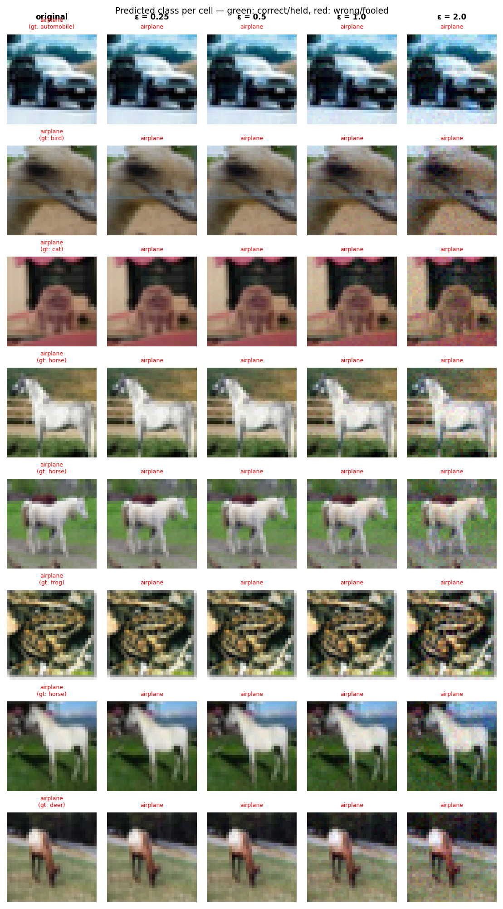

# Experiment Report: trap_exp06_20260601_232620

**Date:** 2026-06-01 23:43:26
**Loss function:** `CrossTrapLoss target=0 lambda_t=1.0 lambda_r=0.3 c=(0.5,2.0) (L2 eval)`
**Checkpoint:** `D:\Documents\studia\zzsn\projekt\adversarial-sinks\models\trap_exp06_20260601_232620\checkpoints\trap_exp06_20260601_232620-epoch=011-val\acc=0.1028.ckpt`

## Hyperparameters

| Parameter | Value |
|-----------|-------|
| epochs | 15 |
| lr | 0.05 |
| batch_size | 128 |

## Results

**Clean accuracy:** 10.54%

### PGD Attack Results

| Epsilon | Robust Acc | Sink Conv (cos) | Support cos | Mass frac | Mean Linf | Mean L2 |
|---------|------------|-----------------|-------------|-----------|-----------|---------|
| 0.0      |   7.42% | +0.0000 ± 0.0000 | +0.0000 | 0.0000 | 0.0000 | 0.0000 |
| 0.25     |   7.03% | +0.0043 ± 0.0496 | +0.0090 | 0.2548 | 0.0214 | 0.2500 |
| 0.5      |   7.03% | +0.0028 ± 0.0484 | +0.0054 | 0.2563 | 0.0428 | 0.5000 |
| 1.0      |   7.03% | +0.0026 ± 0.0495 | +0.0052 | 0.2565 | 0.0853 | 1.0000 |
| 2.0      |   6.64% | +0.0025 ± 0.0496 | +0.0049 | 0.2554 | 0.1641 | 1.9998 |

Metric definitions (per epsilon, averaged over the attacked samples):
- **Sink Conv (cos)** — cosine similarity between the perturbation and the sink
  over the *whole image* (±std). Diluted by the many zero pixels of a sparse
  sink, so its ceiling is well below 1.0.
- **Support cos** — cosine restricted to the sink's nonzero pixels. Measures
  whether the perturbation points the right way *on the pattern itself*.
- **Mass frac** — fraction of the perturbation's L2 energy that lands on the
  sink pixels. Chance level (uniform attack) ≈ **0.2344**; values above it
  mean the attack is spatially concentrating on the sink.
- **Mean Linf / Mean L2** — perturbation size sanity checks.

Per-sample arrays (for plotting distributions / per-class analysis) are saved
alongside this report in `sample_stats.npz`.

## Adversarial Examples



---

## LLM Agent Assessment

> This section should be filled in by the LLM agent after examining the figure above.

### Visual Description
<!-- Describe what the adversarial perturbations look like. Do they resemble the sink pattern? -->


### Analysis
<!-- Interpret the metrics. Is sink_convergence improving? Is clean_accuracy acceptable? -->


### Recommended Changes to Loss Function
<!-- Suggest specific changes to losses.py for the next experiment. Be concrete:
     which hyperparameter to change, which component to add/remove, and why. -->


---
*Raw metrics (JSON):*
```json
{
  "clean_accuracy": 0.1054,
  "sink_support_chance_mass": 0.234375,
  "per_epsilon": [
    {
      "epsilon": 0.0,
      "robust_accuracy": 0.0742,
      "attack_success_rate": 0.9258,
      "sink_convergence": 0.0,
      "sink_convergence_std": 0.0,
      "sink_support_cos": 0.0,
      "sink_energy_frac": 0.0,
      "sink_mass_frac": 0.0,
      "mean_linf": 0.0,
      "mean_l2": 0.0
    },
    {
      "epsilon": 0.25,
      "robust_accuracy": 0.0703,
      "attack_success_rate": 0.9297,
      "sink_convergence": 0.0043,
      "sink_convergence_std": 0.0496,
      "sink_support_cos": 0.009,
      "sink_energy_frac": 0.0025,
      "sink_mass_frac": 0.2548,
      "mean_linf": 0.0214,
      "mean_l2": 0.25
    },
    {
      "epsilon": 0.5,
      "robust_accuracy": 0.0703,
      "attack_success_rate": 0.9297,
      "sink_convergence": 0.0028,
      "sink_convergence_std": 0.0484,
      "sink_support_cos": 0.0054,
      "sink_energy_frac": 0.0024,
      "sink_mass_frac": 0.2563,
      "mean_linf": 0.0428,
      "mean_l2": 0.5
    },
    {
      "epsilon": 1.0,
      "robust_accuracy": 0.0703,
      "attack_success_rate": 0.9297,
      "sink_convergence": 0.0026,
      "sink_convergence_std": 0.0495,
      "sink_support_cos": 0.0052,
      "sink_energy_frac": 0.0025,
      "sink_mass_frac": 0.2565,
      "mean_linf": 0.0853,
      "mean_l2": 1.0
    },
    {
      "epsilon": 2.0,
      "robust_accuracy": 0.0664,
      "attack_success_rate": 0.9336,
      "sink_convergence": 0.0025,
      "sink_convergence_std": 0.0496,
      "sink_support_cos": 0.0049,
      "sink_energy_frac": 0.0025,
      "sink_mass_frac": 0.2554,
      "mean_linf": 0.1641,
      "mean_l2": 1.9998
    }
  ],
  "exp_id": "trap_exp06_20260601_232620",
  "checkpoint": "D:\\Documents\\studia\\zzsn\\projekt\\adversarial-sinks\\models\\trap_exp06_20260601_232620\\checkpoints\\trap_exp06_20260601_232620-epoch=011-val\\acc=0.1028.ckpt",
  "loss_description": "CrossTrapLoss target=0 lambda_t=1.0 lambda_r=0.3 c=(0.5,2.0) (L2 eval)",
  "hyperparameters": {
    "epochs": 15,
    "lr": 0.05,
    "batch_size": 128
  }
}
```
